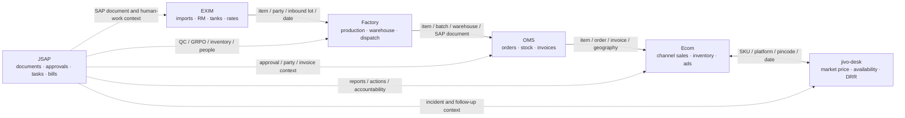

# JIVO CLI Connections — Map of Content

This vault maps how JivoGPT's six current JIVO CLIs can be queried together without pretending that a federated database already exists. Every one of the **15 possible CLI pairs** has its own note. Each edge separates proven shared fields from business-flow inference and records what must still be validated before an automated join is trusted.

> ⛔ Every connection is governed by [[READ_ONLY_LAW]]. A connection may read, normalize, reconcile, cache inside JivoGPT, and cite. It may never write or sync back to EXIM, Factory, OMS, Ecom, jivo-desk's source files, or JSAP.

## The six connector hubs

| Hub | System role | Current read surface |
|---|---|---:|
| [[EXIM_HUB]] | Import/export, raw-material stock, tanks, contracts, licenses, rates, SAP B1 accounts | 65 printed tools; 66 unique read-labelled routes, with one wrapper route under safety dispute |
| [[FACTORY_HUB]] | Three-company plant operations: gate, QC, GRPO, production, warehouse, barcode, dispatch | 183 GET endpoints |
| [[OMS_HUB]] | Orders, quotations, schemes, parties, HANA stock, invoices, SAP sync logs | 73 spec/MCP GET entries; 72 registered runtime endpoint commands |
| [[ECOM_HUB]] | Marketplace sales, inventory, ads, reports, SAP distribution, shipment-planning reads | 138 registered GET commands: 137 current SPA reads + 1 retained legacy route |
| [[JIVO_DESK_HUB]] | VPS file-backed price, availability, price-match, DRR, source freshness, and exact product identity | 8 operational commands + `product` group |
| [[JSAP_HUB]] | SAP documents plus approvals, reports, tasks, tickets, people, bills, and document governance | 146 commands |

Counts are current as of 2026-07-19 and come from [[DATA_SOURCES]], [[EXIM_MAP]], [[FACTORY_MAP]], [[OMS_VERIFICATION]], [[ECOM_MAP]], [[DESK_CLI]], and [[JSAP_MAP]].

## Business and data flow

The solid chain is the primary operational story, not proof of direct database foreign keys. JSAP is an overlay: it explains who approved, reviewed, documented, or acted on records originating in operational systems. Full interpretation: [[VALUE_CHAIN]].

## Evidence scale

| Level | Meaning |
|---|---|
| **Shared-key candidate** | Both sides document the same business identifier, usually a SAP item, party, document, or warehouse code. Equality of live values is not assumed until profiled. |
| **Strong operational join** | The systems cover adjacent stages of one business flow and expose compatible keys plus dates or statuses. No direct API bridge is claimed. |
| **Reconciliation join** | The same metric can be compared across independent sources, such as SKU/platform/date price or stock. Differences are findings, not values to overwrite. |
| **Context join** | One system explains or governs another through people, tasks, tickets, approvals, documents, or freshness rather than a durable record key. |

## All 15 pair notes

| # | Pair | Primary connection | Evidence posture |
|---:|---|---|---|
| 1 | [[EXIM__FACTORY]] | Imported materials, tanks, arrivals, SAP items, GRPO/warehouse intake | Strong operational join; live cross-key equality still to prove |
| 2 | [[EXIM__OMS]] | SAP items, business partners, open documents, stock and planning | Shared-key candidate + operational context |
| 3 | [[EXIM__ECOM]] | Landed/input economics and stock versus downstream channel sales and inventory | Reconciliation + value-chain context |
| 4 | [[EXIM__JIVO_DESK]] | Commodity/JIVO rates versus marketplace price and DRR signals | Reconciliation; requires product-code mapping |
| 5 | [[EXIM__JSAP]] | SAP purchase/GRPO/party documents, bills, approvals, and audit context | Shared-key candidate + context join |
| 6 | [[FACTORY__OMS]] | Finished goods, warehouse stock, batches, dispatches, orders, and SAP documents | Strong operational join |
| 7 | [[FACTORY__ECOM]] | Factory/Mart stock and dispatch versus marketplace inventory, sell-through, and shipments | Strong operational + reconciliation join |
| 8 | [[FACTORY__JIVO_DESK]] | Supply/dispatch availability versus observed marketplace availability and price | Exact listing-to-qualified-Factory bridge released; reconciliation remains read-only |
| 9 | [[FACTORY__JSAP]] | GRPO, QC, inventory audit, SAP documents, employees, and maintenance follow-up | Shared-key candidate + context join |
| 10 | [[OMS__ECOM]] | Orders, quotations, stock and invoices versus channel sales, state, inventory, and PO views | Strong operational + reconciliation join |
| 11 | [[OMS__JIVO_DESK]] | Internal stock/order demand versus observed availability, price-match, and DRR | Reconciliation; SKU/date bridge required |
| 12 | [[OMS__JSAP]] | Parties, orders, invoices and SAP logs versus approvals, bills, reports, and document history | Shared-key candidate + context join |
| 13 | [[ECOM__JIVO_DESK]] | Two marketplace lenses over SKU, platform, pincode, price, availability, date, and freshness | Strongest reconciliation join |
| 14 | [[ECOM__JSAP]] | Channel performance exceptions versus reports, tasks, tickets, MOMs, and accountable people | Context join; SAP/geography keys may strengthen it |
| 15 | [[JIVO_DESK__JSAP]] | Price/availability/DRR exceptions versus tickets, tasks, owners, and decisions | Workflow/context join |

## Canonical join contract for JivoGPT

Every connector adapter should emit these normalized fields when the source supplies them. Preserve the raw field beside the normalized field; normalization must never erase source truth.

| Canonical field | Examples of source fields | Rule |
|---|---|---|
| `company_key` | `JIVO_OIL`, Jivo Wellness, company id `1` | Map through a dated alias table; never equate companies from label similarity or raw numeric id. Factory id `2` means Mart while JSAP id `2` means Beverage. |
| `sap_schema` | source company/database or HANA schema | Qualify SAP-derived keys by the source company/database whenever the schema is known. |
| `item_key` | qualified Factory identity, reviewed JID/product key, `item_code`, `ItemCode`, `sku_code` | For Factory/jivo-desk use the released [[CLI/product-identity/README|Product Identity Bridge]]: company + schema + item code and platform + listing ID. Names are discovery text, never operational join keys. Other connectors still require qualified evidence. |
| `party_key` | `card_code`, `cardCode`, vendor/customer/BP code | Normalize case and whitespace only; do not join numeric local ids to SAP card codes. |
| `document_key` | `DocEntry`, `DocNum`, order id, invoice id, PO number, GRPO number | Store SAP object/document type, company/database, system, and whether the value is DocEntry or DocNum. Never equate DocEntry with DocNum. |
| `warehouse_key` | `warehouse_code`, `whs_code`, warehouse id | Prefer SAP warehouse code; retain source-local id and name. |
| `batch_key` | batch/lot, barcode box/pallet, stock-status lot | Join only when item and company also match. |
| `geography_key` | state, city, pincode, branch, distributor | Normalize through reference tables; pincode stays a string to preserve leading zeroes. |
| `platform_key` | amazon, blinkit, swiggy, zepto, flipkart | Use one dated alias registry because source slugs differ. |
| `observed_at` / `as_of_date` | transaction time, report month, file mtime | Preserve both event time and source freshness. Never present an undated reconciliation. |

## What this vault does not claim

- No pair note proves that two APIs share a database, even when both read SAP.
- Matching field names are candidate keys, not proof that live values use the same namespace.
- A value-chain arrow does not authorize a write, refresh trigger, approval, upload, or status transition.
- jivo-desk's operational product filters now require exact identities from the released bridge; `product search` remains discovery-only and must never be promoted into a join automatically.
- Empty, gated, stale, or upstream-error responses remain evidence about visibility and freshness, not zero-valued business facts.
- EXIM's `GET /sap_sync/open-grpos/` is excluded from safe connection recipes until its documented refresh side effect and the conflicting wrapper/HARD-RULE treatment are resolved.

## Recommended implementation order

1. Materialize the canonical dimensions above with provenance and as-of dates.
2. Start with [[ECOM__JIVO_DESK]] reconciliation because both sides expose the clearest marketplace dimensions.
3. Add the SAP item/party/document spine across EXIM, Factory, OMS, Ecom, and JSAP.
4. Add company and warehouse alias tables before any cross-company aggregate.
5. Attach JSAP tasks, tickets, approvals, bills, and MOMs as context edges; do not use them to overwrite operational records.
6. Serve pair-specific query recipes through JivoGPT with citations to every contributing connector.

---
Linked: [[/README|README]] · [[VALUE_CHAIN]] · [[docs/ARCHITECTURE|ARCHITECTURE]] · [[DATA_SOURCES]] · [[READ_ONLY_LAW]] · [[EXIM_HUB]] · [[FACTORY_HUB]] · [[OMS_HUB]] · [[ECOM_HUB]] · [[JIVO_DESK_HUB]] · [[JSAP_HUB]]
