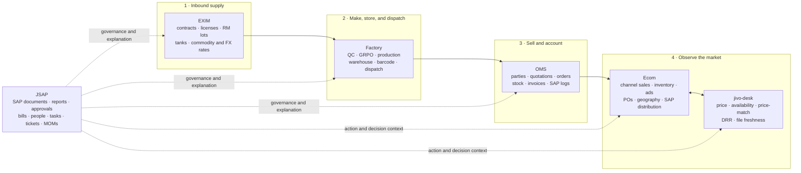

# JIVO CLI Value Chain

The six CLIs form four complementary lenses over JIVO: physical supply, SAP/business documents, marketplace demand, and human governance. Together they can answer end-to-end questions that no one CLI can answer alone.

> This is a **read-only analytical chain**. Arrows describe how facts relate; they do not instruct JivoGPT to advance stock, approve an order, refresh SAP, create a ticket, or change any source.

## End-to-end model

## Layer 1 — Physical supply

[[EXIM_HUB]] sees imported raw-material lots before and during arrival: contracts, stock lifecycle, tanks, commodity/rate inputs, licenses, open POs/GRPOs, and SAP-sourced RM/FG masters. [[FACTORY_HUB]] sees the campus operation: gate entry, QC, GRPO, production, warehouse stock, barcode lineage, intercompany transfers, and dispatch across Jivo Oil, Jivo Mart, and Jivo Beverages.

The most useful candidate spine is:

`company + SAP item code + lot/batch + warehouse + document number + event date`

The item-code bridge is strongest where Factory already records SAP `item_code` / `FG####` values. EXIM also exposes RM/FG `item_code` and party/card codes. Bare code equality is not enough: `FG0000424` is documented with conflicting product descriptions in EXIM and a Factory sample. Require company/schema, as-of date, item name, and pack checks. A direct EXIM-lot-to-Factory-batch foreign key is **not documented**, so the first implementation must measure join coverage and publish unmatched rows rather than silently dropping them. See [[EXIM__FACTORY]].

## Layer 2 — SAP and commercial documents

[[OMS_HUB]] adds customer-facing demand: party/product assignments, quotations, orders, stock checks, HANA inventory/batches, invoices, and SAP logs. [[JSAP_HUB]] adds purchase/GRPO/AP documents, BP master, approval reports, bill verification, document history, and the people responsible for work.

Across EXIM, Factory, OMS, Ecom, and JSAP, the recurring join candidates are:

- SAP item code / finished-good code;
- business-partner `CardCode` / vendor code;
- `DocEntry`, `DocNum`, PO, GRPO, quotation, order, and invoice identifiers;
- warehouse code and company scope;
- document date, posting date, and status history.

Those values can collide across companies and document types. `DocEntry` and `DocNum` are also different identifiers and must never be silently equated. The normalized key must therefore be composite: `source_system + canonical_company + SAP database/schema + object_type + id_kind + raw_document_id`. See [[EXIM__OMS]], [[FACTORY__OMS]], [[EXIM__JSAP]], [[FACTORY__JSAP]], and [[OMS__JSAP]].

## Layer 3 — Marketplace demand and execution

[[ECOM_HUB]] observes downstream channel performance across marketplaces: sales, primary/secondary views, inventory, DOH/SOH, ads, coupons, brand fund, Amazon POs/appointments, state/city breakdowns, and SAP distribution reads. This can be compared with Factory supply/dispatch and OMS orders/stock, but the systems answer different questions:

- Factory: what was made, stored, scanned, or dispatched;
- OMS: what was quoted, ordered, available, invoiced, or sent to SAP;
- Ecom: what platforms, distributors, geographies, and marketplace workflows report;
- jivo-desk: what the independent daily sweep files observed about price and availability.

Differences are not automatically errors. Timing, platform scopes, order stages, warehouse scopes, and stale extracts can all explain them. See [[FACTORY__ECOM]], [[OMS__ECOM]], [[FACTORY__JIVO_DESK]], and [[OMS__JIVO_DESK]].

## Layer 4 — Market feedback and freshness

[[JIVO_DESK_HUB]] is deliberately independent and file-backed. It reads raw daily marketplace sweeps, price-match sheets, DRR panels, and health logs with file mtimes. [[ECOM_HUB]] is the application/API lens with platform dashboards, uploads, SAP distribution, reports, and stored analytics.

Their reconciliation grain is:

`normalized product + platform + pincode/geography + observation date + source freshness`

This is the best first cross-CLI product because it can identify stale application data, platform coverage gaps, price mismatches, and disagreements between a raw sweep and the curated dashboard while preserving both sources. See [[ECOM__JIVO_DESK]].

## JSAP as the human and governance overlay

JSAP does not sit at one physical step. It spans the chain:

- BP master and SAP document reads can contextualize EXIM/OMS counterparties and documents;
- inventory audit, QC structure, and purchase/GRPO documents can contextualize Factory records;
- approval reports and bill verification can explain document status and financial follow-through;
- tasks, tickets, employee hierarchy, document hub, and MOM dashboards can explain who owns an exception and what was decided.

No current read-only CLI is allowed to create the task or change the approval. JivoGPT may retrieve existing JSAP context and answer, “this discrepancy is already tracked in ticket X,” but it must not become the action path. See [[ECOM__JSAP]] and [[JIVO_DESK__JSAP]].

## Cross-chain questions this unlocks

1. **Supply to demand:** Which finished goods have upstream material/production evidence but weak marketplace availability?
2. **Order to fulfilment:** Do OMS order and stock signals align with Factory dispatch and Ecom channel inventory for the same item and period?
3. **Price economics:** How do EXIM commodity/JIVO rates relate to current marketplace price and price-match exposure for mapped products?
4. **Freshness triage:** Is a surprising Ecom number confirmed by today's raw sweep, or is one source stale/gated?
5. **Document trace:** For a SAP item/party/document, what do EXIM, Factory, OMS, Ecom SAP views, and JSAP document/approval views each know?
6. **Accountability:** Is an observed stock, price, or document exception already present in a JSAP report, ticket, task, MOM, or bill-verification queue?

## Answer lineage contract

Every multi-CLI answer must carry:

- connector and command/endpoint family;
- raw source identifier and normalized join key;
- company/tenant and platform/geography scope;
- event date plus source `as_of_date` or file mtime;
- access state (`live`, `empty`, `403-gated`, `upstream-error`, `stale`, `fallback`);
- unmatched-row counts and join confidence;
- a citation for every numeric claim.

An empty result from a role-gated OMS/JSAP surface, a 403 from Ecom Shipment Planner, or a stale jivo-desk file is not zero. It is a visibility/freshness state and must be reported as such.

## Build boundary

The Connections vault defines the graph and normalization contract. The running implementation belongs in [[docs/ARCHITECTURE|ARCHITECTURE]] Layer 4:

1. read each connector through its safe surface;
2. normalize into JivoGPT-owned tables with provenance;
3. build deterministic joins before semantic retrieval;
4. expose pair-level reconciliation views;
5. let the engine reason over those views and cite the original sources.

No source-system write, upload, refresh trigger, approval, sync-back, or mutation is part of this design.

EXIM's wrapper route `GET /sap_sync/open-grpos/` is specifically withheld from the safe surface until the repo's conflict is resolved: [[CLI/exim/HARD-RULE|EXIM HARD-RULE]] excludes the underscore namespace as sync-like, while the wrapper exposes the route and its endpoint note says it may refresh from SAP.

---
Linked: [[/README|README]] · [[CONNECTIONS_MOC]] · [[docs/ARCHITECTURE|ARCHITECTURE]] · [[DATA_SOURCES]] · [[READ_ONLY_LAW]] · [[EXIM_HUB]] · [[FACTORY_HUB]] · [[OMS_HUB]] · [[ECOM_HUB]] · [[JIVO_DESK_HUB]] · [[JSAP_HUB]]
