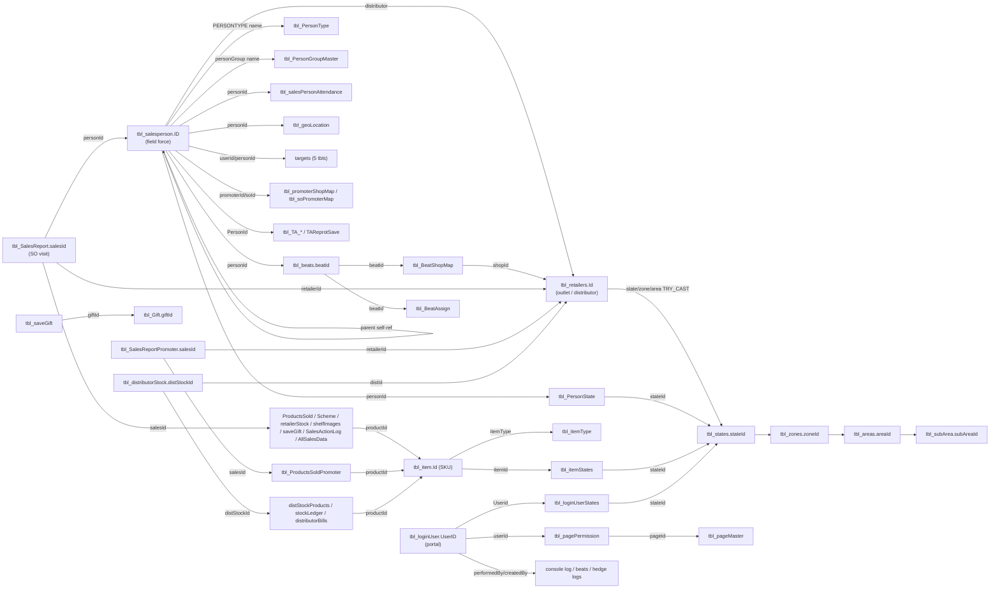

# DSR_V6 — Master Index

**System:** JIVO Wellness DSR (Daily Sales Report / Sales Force Automation). SQL Server DB `DSR_V6`, schema `dbo` — 208 tables, ~47.5 M rows, but **only 1 declared foreign key** in the whole database (`tbl_zones.stateId → tbl_states.stateId`); every other relationship below is convention-only and was verified live by join on 2026-07-29 via the read-only `dsr` CLI.

DSR runs two parallel field forces on one Android app + one web portal. **Sales Officers (SO)** walk named daily **beats** (retailer routes) and book **secondary sales** (distributor→retailer). **Promoters/Merchandisers** sit inside modern-trade stores and push product off-shelf. Both punch GPS attendance and stream a location breadcrumb. Above them: **Distributors/Super-stockists** (stored *inside* the retailer master, `type='Distributor'`) supply the shops; **primary sales** move goods JIVO→distributor and are reconciled against SAP B1. A back-office portal maintains masters (people, outlets, SKUs, geography, schemes), approves records, sets monthly targets, uploads primary/e-com files, and runs MIS/attendance/coverage reports. The spine of the model is four id columns — **person, retailer, item, beat** — plus the visit header id `salesId` and a 4-level geography hierarchy.

**Universal caveats (apply everywhere):** soft-delete is `deleted` (0=live), often **nullable** → use `ISNULL(deleted,0)=0`; masters carry ~85–90% deleted rows. `-1` = "unset / ALL" sentinel on id columns; `1899-12-30` (and `1753-01-01`, `1900-01-01`, `2019-12-31`) are empty-date sentinels — always bound date ranges. `tbl_retailers.state/zone/area` are **nvarchar holding ids** → `TRY_CAST`. Several lookups join **by name not id** (`PERSONTYPE`, `personGroup`, `itemGroup`, `groupType`). Never print `password`/`passcode` columns. No SAP bridge is populated (`SAPID` NULL everywhere) — reconcile to SAP by name/code.

---

## Subsystems

| # | Subsystem doc | Tables | One-line purpose |
|---|---|---:|---|
| 1 | `portal-users-and-permissions` | 5 (+1 shared) | Web-portal back-office logins, roles, page catalogue, per-user×page CRUD ACL, edit log |
| 2 | `sales-person-master` | 6 | Field-workforce master (HR+payroll+app-login+org-chart node) + designation/group/JWPL-code lookups |
| 3 | `geography-and-scoping` | 7 | State→Zone→Area→SubArea hierarchy + person/user/item→state scoping maps |
| 4 | `retailer-master` | 8 | Outlet master (Shop/Distributor/Modern Store) + feedback, edit audit, geo-fence "hedge" & merge logs |
| 5 | `product-master` | 6 | SKU catalogue (oils/ghee/beverages) + type/UOM/pack-group/flavour/image lookups |
| 6 | `beats-and-routes` | 5 | Named daily routes: beat master, beat↔shop map, beat calendar, membership logs |
| 7 | `field-sales-entry` | 15 | SO secondary-sale visit header + product/scheme/stock/shelf lines, gifts, approval/edit/call-centre audit |
| 8 | `promoter-activity` | 7 (+1 shared) | Promoter in-store visits (mirror of #7), shop/SO maps, onboarding scans, raw JSON log |
| 9 | `attendance-and-geo-tracking` | 8 | GPS attendance punches, 27M-row breadcrumb trail, selfies, device-swap & push maps, attendance audit |
| 10 | `distributor-stock` | 6 | Distributor stock declarations, ledger, monthly snapshot, dist→shop map, bill photos |
| 11 | `primary-sales` | 6 | JIVO→distributor primary stock/sales, distributor-order file ingest + name-map, SAP sales mirror |
| 12 | `targets-and-sales-aggregates` | 8 | Monthly/daily targets (person, category, retailer) + precomputed retailer monthly/last-sale rollups |
| 13 | `travel-allowance` | 5 | Per-km rate, home↔shop & area↔area distance, travel-mode lookup, saved daily TA report |
| 14 | `ecom-marketplace-import` | 7 | Amazon/Flipkart file-loader: online invoices, returns, settlement header/lines, load-status control |
| 15 | `logs-and-exceptions` | 3 | Platform diagnostics: API/mobile exception firehose, free-text dev/report-SQL log, console action audit |

*Shared table: `tbl_salesPersonAttendance` (#9) is read by #8; `tbl_loginUserStates` (#1) and `tbl_itemStates` (#5) also live in #3.*

---

## Linkage map — the join keys that tie DSR together

Everything hangs off five identity keys (all `int`, all referenced under aliased column names, none FK-enforced):

| Hub key (PK) | Referenced as | Reached from (examples) |
|---|---|---|
| `tbl_salesperson.ID` | `personId`, `userId`, `soId`, `promoterId`, `salePersonId`, `createdById`, `transcationBy`, `parent`, app-side `changedBy` | beats, sales reports, attendance, geoLocation, PersonState, targets, TA, dist stock, promoter maps |
| `tbl_retailers.Id` | `retailerId`, `shopId`, `distId`, `custId`, `entityId` | beat map, sales reports, retailer stock, gifts, monthly sale/target, dist stock, TA km, hedge logs |
| `tbl_item.Id` | `productId`, `itemId`, `skuID` | ProductsSold(+Promoter/Scheme), retailerStock, dist stock/orders, primary, itemStates, flavours, images |
| `tbl_beats.beatId` | `beatId`, `fromBeatId`, `toBeatId` | BeatShopMap, BeatAssign, beatShopLog, movement log, console-log `beat=` |
| `tbl_SalesReport.salesId` | `salesId`, `SalesId`, `Sales_PId` | ProductsSold, SchemeProductsSold, retailerStock, shelfImages, saveGift, SalesActionLog, AllSalesData |

Secondary hubs: **geography** `stateId`/`zoneId`/`areaId`/`subAreaId` (retailer cols are text→`TRY_CAST`; sales tables carry both ids and denormalized name snapshots); **portal identity** `tbl_loginUser.UserID` (all back-office `createdBy`/`performedBy`/`deletedBy`/`changedBy` on masters & logs — **collides numerically with `tbl_salesperson.ID`, never interchange**); **scheme/gift** `tbl_Gift.giftId`; **distributor** `distId → tbl_retailers.Id (type='Distributor')` and `distStockId → tbl_distributorStock/Primary`. Distributors are retailers; promoters/SOs/managers are all salesperson rows; managers report via `tbl_salesperson.parent`.

---

## Coverage checklist — portal menu → backing tables → proposed `dsr` commands

| Portal menu item | Backing tables | Proposed `dsr` command(s) | Status |
|---|---|---|---|
| **Dashboard** (MIS achievement) | `tbl_SalesReport`+lines, `todayTarget`, `tbl_salesPersonMontlhyTarget`, `tbl_categoryWiseTargets` | `dsr dashboard`, `dsr so-productivity`, `dsr target` | mapped |
| **Masters > App Users** | `tbl_loginUser`, `tbl_roles`, `tbl_loginUserStates`, `tbl_loginUserLog`; app-cred view of `tbl_salesperson` | `dsr users`, `dsr user-log` | mapped |
| **Masters > Retailers** | `tbl_retailers` (+ `tbl_retailersModifiedLog`, `tbl_RetailerHedgeLog`, `tbl_retailer_*hedge`, `tbl_mergeRetailerHedgeLog`, `tbl_RetailerGroup`) | `dsr retailers`, `dsr retailer-hedge`, `dsr retailer-audit` | mapped |
| **Masters > Scheme Record** | `tbl_Gift`, `tbl_GiftMapwithRetailer`, `tbl_saveGift`, `tbl_SchemeProductsSold`, `tbl_item.isScheme` | `dsr schemes`, `dsr gift-issued` | mapped (scheme = gift/combo engine; no separate "scheme master" table) |
| **Masters > Daily Person Attendance** | `tbl_AttendanceAudit` (half-day P/A register), `tbl_attendanceLog` | `dsr attendance-register` | mapped |
| **Masters > SO Attendance** | `tbl_salesPersonAttendance` (SO person-types) | `dsr attendance` | mapped |
| **Masters > Promoter Attendance** | `tbl_salesPersonAttendance` (PROMOTER%/MERCHANDISER) | `dsr attendance --promoter` | mapped |
| **Masters > Add Zone** | `tbl_states`, `tbl_zones`, `tbl_areas`, `tbl_subArea` | `dsr geo`, `dsr geo-tree` | mapped |
| **Masters > App Device Tracker** | `deviceTracker`, `tbl_userGcmMap` | `dsr device-changes` | mapped |
| **Masters > Sales Person** | `tbl_salesperson` (+ `tbl_PersonType`, `tbl_PersonGroupMaster`, `tbl_PersonState`, `tbl_salespersonLogs`, `tbl_dsrjwpl`, `tbl_hierarchy`) | `dsr salespersons`, `dsr org-chart`, `dsr salesperson-log` | mapped |
| **Masters > Item** | `tbl_item` (+ `tbl_itemType`, `tbl_UOMMaster`, `tbl_ItemGroupName`, `tbl_flavours`, `tbl_ItemImages`, `tbl_itemStates`) | `dsr items`, `dsr item-states` | mapped |
| **Masters > Permissions** | `tbl_pageMaster`, `tbl_pagePermission`, `tbl_roles` | `dsr permissions` | mapped |
| **Sales Entry** | `tbl_SalesReport`+lines (SO); `tbl_SalesReportPromoter`+`tbl_ProductsSoldPromoter` (promoter); `tbl_SoAppSalesJsonLog` | `dsr visits`, `dsr visit-lines`, `dsr promoter-visits` | mapped |
| **Beats** | `tbl_beats`, `tbl_BeatShopMap`, `tbl_BeatAssign`, `beatShopLog`, `tbl_BeatShopMovementLog` | `dsr beats`, `dsr beat-shops`, `dsr beat-coverage` | mapped |
| **Audit** (All-Sales/MIS) | reads `tbl_SalesReport`/`tbl_ProductsSold`; writes `hslog`; `tbl_SalesActionLog`, `tbl_AndroidConsoleActionLog` | `dsr audit`, `dsr console-log` | mapped |
| **HR Approval** (HR APPROVAL PORTAL) | `tbl_salesperson.approvedStatus/approvedBy/approvedOn` — no dedicated table (`tbl_approvalHead` is 0 rows) | `dsr hr-approvals` (pending salespersons) | **OPEN** — workflow rides on salesperson approval columns; no distinct backing table |
| **MIS Emp Approval** (MIS EMP APPROVAL PORTAL) | `tbl_salesperson` approval columns; overlaps HR Approval | `dsr emp-approvals` | **OPEN** — backing not distinguished from HR Approval; needs live portal confirmation |
| **Primary Sales Upload** | `tbl_primary_sales`, `tbl_distributorPrimary`, `tbl_distPrimaryProducts`, `tbl_distorders`, `tbl_distmappings`, `sap_sales_log` | `dsr primary-sales`, `dsr primary-stock`, `dsr dist-orders`, `dsr sap-sales` | mapped |
| **Reports** (SO/Promoter/Location/Beat) | `tbl_SalesReport(Promoter)`, `tbl_geoLocation`, `tbl_messagesFromAndroid`, beats, `retailerLastSale`, `tbl_retailerMonthlySale` | `dsr so-productivity`, `dsr track`, `dsr selfies`, `dsr beat-coverage`, `dsr retailer sales` | mapped |
| **Dist/Super** | `tbl_distributorStock`, `tbl_distStockProducts`, `tbl_stockLedger`, `tbl_monthlystock`, `tbl_distributorShopMap`, `tbl_distributorBills` | `dsr dist-stock`, `dsr dist-onhand`, `dsr monthly-stock`, `dsr dist-shops` | mapped |

**Other portal pages present in `tbl_pageMaster` (32 rows) but outside the listed menu** — all have backing docs: Travelling Allowance (#13 → `dsr ta-report`), Targets (#12 → `dsr target`), Call Center / Order confirmation (`tbl_CC_Orders`, `tbl_AllSalesData` in #7 → `dsr order-confirm`), Un-approved Shops / Approval Duplicacy (retailer approve/merge → #15 `dsr console-log` + **`tbl_dupshops`, see GAPS**), Unapproved Stock (#10), Android Console (#9/#15), File Uploader / Ecom import (#14 → `dsr ecom-*`), Organizational Chart (#2 `dsr org-chart`), Email Preference (`tbl_loginUser.email`).

---

## GAPS — live tables (rows > 0) covered by no subsystem doc

After excluding `_bak` / `_temp` / `_dup*` / date-suffixed / `Sheet1$` / `TempTable` / `new` / `to1` / `abc` scratch-and-backup twins, the following **live** tables are not documented:

| Table | Rows | Assessment |
|---|---:|---|
| `tbl_dupshops` | 127,099 | **Genuine gap.** The duplicate-shop candidate set behind the **Approval Duplicacy / Un-approved Shops** merge workflow (see #15 console log, which records only the *action*, not the candidate list). A 58-col clone of `tbl_retailers`. Worth its own mini-doc if the dedupe/merge workflow is in scope. Variants `tbl_dupshops_l4` (45,995), `tbl_dupshops_20240429`, `tbl_dupshops_bak` are date-suffixed/backup noise. |
| `tbl_retailers_oldcontacts` | 49,088 | Archive/snapshot of retailer rows with old contact numbers (58-col retailer clone) — effectively a backup, low value, safe to treat as noise. |
| `tests` | 2,981 | 2-col scratch/test table — noise. |
| `tbl_numbertable` | 365 | Utility tally/numbers table (`rownum`), consumed *by* report queries (hslog CS-split, attendance calendars). Infrastructure, not business data. |
| `tbl_dual` | 1 | Oracle-style `DUAL` scratch — noise. |

**Net:** the model's business surface is fully covered by the 15 docs. The one substantive uncovered live business table is **`tbl_dupshops`** (duplicate-retailer staging for the merge workflow); everything else uncovered is scratch, archive, or a query helper. All 77 zero-row tables (`ActualSales`, `tbl_updatesalary*`, `tbl_return*`, `Tbl_Dist_Login`, `USER_ATTANDENCE`, `salarydetails`, `sysdiagrams`, …) are dormant/never-implemented features and correctly out of scope.
