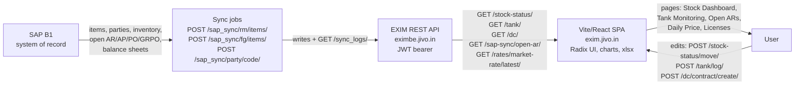

# Architecture

How JIVO EXIM is built: a Vite/React SPA talking to a Django-style REST API, with SAP B1 as the upstream system of record.

## Frontend — `https://exim.jivo.in`

- Vite/React single-page app; routing is client-side (`/stock/stock-status`, `/accounts/open-ars`, `/reports/director-dashboard`, ...). See [[INDEX]] for all 38 pages.
- Radix UI component primitives, chart components for trend/price series (e.g. the datasets returned by `GET /daily-price/trends/`), and xlsx export on data tables.
- Units toggle on stock views: KG / MTS (metric tonnes) / LITERS. Money in INR, displayed in Cr/Lakh.
- Tokens stored in `localStorage` (`access_token` / `refresh_token`).

## Backend — `https://eximbe.jivo.in`

- Django-style REST API: every route ends in a trailing slash (`/stock-status/`, `/tank/log/`).
- Auth is JWT access + refresh: `POST /account/login/` returns `{access, refresh, name, email, id, permissions}`; requests carry `Authorization: Bearer <access>`; on 401 the SPA calls `POST /account/login/refresh/`. Details: [[AUTH]].
- The login response embeds a per-user permission map (resource -> ops like view/add/change/delete/sync/fetch); the full table is in [[DOMAIN-MODEL]].

## SAP B1 — system of record

EXIM does not own master or financial data; it pulls it from SAP B1:

- **Masters**: `POST /sap_sync/rm/items/` (raw materials), `POST /sap_sync/fg/items/` (finished goods), `POST /sap_sync/party/{code}/` (business partners). Synced results are read via `GET /items/rm/`, `GET /items/fg/`, `GET /parties/`.
- **Inventory**: `GET /sap-sync/inventory/` (raw/factory), `GET /sap-sync/finished-inventory/`.
- **Open documents**: `GET /sap-sync/open-ar/`, `GET /sap-sync/open-ap/`, `GET /sap-sync/open-pos/`, `GET /sap_sync/open-grpos/`.
- **Balance sheets and aging**: `GET /sap-sync/balance-sheet/` (Oil Dr/Cr), `GET /sap-sync/custa/balance-sheet/`, `GET /sap-sync/vendor/balance-sheet/`, `GET /sap-sync/customer-aging-balance/`.
- **Planning**: `GET /sap-sync/planned-months/`, `GET /sap-sync/monthly-planning/`.
- Every sync run is logged: `GET /sync_logs/` (type, status, counts), surfaced on the Admin > Sync Logs page.

Note the mixed spelling: most read routes use `sap-sync`, the GRPO read and the trigger routes use `sap_sync`.

## Data domains

| Domain | Core endpoints | Pages |
|---|---|---|
| **Stock Status** | `/stock-status/`, `/stock-status/stock-dashboard/`, `/stock-status/stock-insights/`, `/stock-status/vehicle-report/`, `/stock-status/debit-entries/`, `/stock-status/contractual-history/` | Stock Status, Stock Dashboard, Vehicle Report, Shortage Report, Contractual History |
| **Tanks** | `/tank/`, `/tank/log/`, `/tank/items/`, `/tank/tank-summary/`, `/tank/capacity-insights/`, `/tank/item-wise-summary/` | Tank Monitoring, Tank Data, Tank Logs, Tank Items, In Tank Breakdown |
| **Domestic Contracts** | `/dc/` (by FY), `/dc/dropdown/`, `/dc/contract/create/`, `/dc/freight/create/{id}/`, `/dc/loading/create/{id}/`, `/sap_sync/open-grpos/` | Domestic Contracts FY 25-26 and 26-27, Open GRPOs |
| **Licenses** | `/license/advance-license-headers/`, `/license/advance-license-import-lines/` (BOE), `/license/advance-license-export-lines/` (shipping bills), `/license/dfia-license-header/list/` | Advance License, DFIA License |
| **Rates / Prices** | `/daily-price/db-list/`, `/daily-price/trends/`, `/jivo-rate/range/`, `/rates/market-rate/latest/`, `/rates/basic-rate/`, `/rates/rate-table/latest/`, `/exim-rates/fetch/` | Daily Price, Jivo Rates, Market Rates, Our Rates, Exchange Rates |
| **Accounts** | the `sap-sync` balance-sheet / open-doc / aging endpoints above | Customer Aging, Customer/Vendor Outstanding, Open ARs/APs/POs, Oil Dr/Cr Outstanding |

There is also `POST /ai/chat/`, an AI assistant over EXIM data, and `GET /director-inventorty/` (sic), the director rollup of finished + at-factory + in-transit inventory feeding the Director Dashboard.

## Stock status lifecycle

Imported raw-material lots move through fixed statuses:

`IN_CONTRACT -> ON_THE_SEA -> MUNDRA_PORT -> ON_THE_WAY -> UNDER_LOADING -> AT_REFINERY -> OUT_SIDE_FACTORY -> COMPLETED`

`GET /stock-status/?status=...` filters by stage; transitions happen through `POST /stock-status/move/`, `POST /stock-status/arrive-batch/`, `POST /stock-status/dispatch/`. Every field change is audited (`GET /stock-status/stock-logs/`, resources `stockstatusfieldlog` / `stockstatusupdatelog` / `stockstatuschangesession`).

## Read vs write/sync split

- **Reads (64)**: all GET endpoints. Safe for tooling; this is the entire surface the `exim-pp-cli` in `cli/` exposes.
- **Writes (31)**: POST/PATCH/DELETE — creating/updating stock rows, tanks, tank logs, license headers/lines, domestic contracts, users, and the `sap_sync` trigger endpoints that pull fresh data from SAP. `POST /account/logout/` invalidates the refresh token, so tooling must never call it.

## Data flow

_Part of [[INDEX]]_

Linked: [[CLI/exim/INDEX|INDEX]] · [[docs/EXIM_MAP|EXIM_MAP]] · [[docs/READ_ONLY_LAW|READ_ONLY_LAW]]
