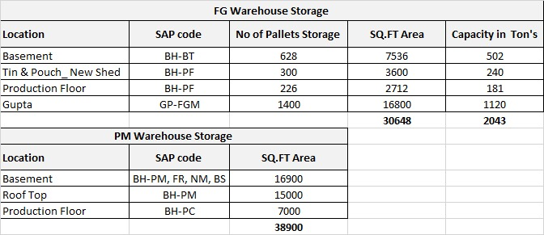

# How much each godown can actually hold

**Given and ruled by Daman, 2026-08-29.** This is the authority on capacity and
**replaces every earlier assumption.** Before it, no capacity figure existed
anywhere in the engine — a production requirement could exceed the floor it had to
stand on and nothing would flag it. Companion to [GODOWNS.md](GODOWNS.md), which
says which godowns *count*; this one says how much *fits*.



> [!warning] The sheet is THREE companies, not one. Oil gets 923 T, not 2,043 T.
> `BH-BT`/`BH-PF` are Oil · `GP-FGM` is **Mart** · `FR` is **Beverages**. Reading
> the 2,043 T total as Oil's capacity overstates it by 121%. Verified in SAP
> 2026-08-29 — see the mapping table below. This is [C-0032](../../harness/corrections/C-0032-establish-a-figures-file-s-company-scope.md)
> (establish a figures file's company scope) biting again on a fresh sheet.

## Ton = LITRE here

**Ruled by Daman, 2026-08-29.** Capacity is sale-side tonnes: **1 T = 1,000 L**
(volume), per [C-0050](../../harness/corrections/C-0050-a-tonne-means-litres-on-the-sale-side-ki.md).
So `BH-BT` holds 502,000 litres at peak, not 502,000 kg. Oil is 910 g/L, so if you
ever hand a capacity figure to procurement, convert: 1 purchase-MT = 1,098.9 L.

## Finished goods — what belongs to Oil

| Physical location | SAP code | Company | Pallets | Sq.ft | Peak (T) | Counts for Oil |
|---|---|---|---:|---:|---:|:--:|
| Basement | `BH-BT` | Oil | 628 | 7,536 | **502** | ✅ |
| Tin & Pouch — New Shed | `BH-PF` | Oil | 300 | 3,600 | 240 | ✅ |
| Production Floor | `BH-PF` | Oil | 226 | 2,712 | 181 | ✅ |
| Gupta | `GP-FGM` | **Mart** | 1,400 | 16,800 | 1,120 | ❌ |
| Sheet total | | | 2,554 | 30,648 | 2,043 | |
| **Oil's real ceiling** | | | **1,154** | **13,848** | **923** | |

### `GP-FGM` is Mart's — committed, do not count it

**Daman, 2026-08-29: "GP-FGM is mart's warehouse which we will not be considering
for now" / "committed to mart".** SAP confirms it is a real, busy Mart warehouse
holding 203,884 FG pcs today:

| | |
|---|---|
| Code | `GP-FGM` — "GUPTA FINISHED GOODS MART" |
| Database | **`JIVO_MART_HANADB`** |

> [!important] `GP-FGM` (Mart) is NOT `GP-FG` (Oil).
> Different codes, different company databases. Oil has its own
> `GP-FG` "GUPTA GODOWN BASEMENT FINISHED GODOWN" holding 2,615 pcs / 20.7 T — same
> Gupta building, Oil's corner of it. The sheet's 1,120 T row is Mart's allocation
> and none of it is Oil's to plan against.

## Working vs peak — the numbers to plan against

**Daman gave BH-BT: 450 T working, 500 T peak** (sheet says 502). He asked me to
get BH-PF's from SAP. I reconstructed daily occupancy in litres from `OINM`
movements, anchored to today's `OITW` balances:

| Code | Sheet peak | Observed peak | When | Working figure | Basis |
|---|---:|---:|---|---:|---|
| `BH-BT` | 502 | **482.3 T** | 2026-08-18 | **450 T** | Daman |
| `BH-PF` | 421 | **376.3 T** | 2026-08-22 | **377 T** | derived — see below |

**Two independent routes give BH-PF the same answer.** Daman's haircut at BH-BT is
450 / 502 = **89.6%**. Applying it to BH-PF's 421 gives **377.4 T**. In 394 days
BH-PF's reconstructed occupancy never once exceeded **376.3 T**. The two agree to
0.3%, so 377 T is a real ceiling the floor has been respecting, not an assumption.

**Oil FG working capacity = 450 + 377 = 827 T. Peak = 923 T.**

> [!note] Caveats on the reconstruction, stated plainly
> - **`BH-BT` is five weeks old.** First movement 2026-07-22; only 38 days exist.
>   It reached 96% of its sheet capacity inside its first month, and its 482.3 T
>   peak ran *past* the 450 T working figure — so the peak headroom does get used.
> - **Observed peaks are lower bounds.** The reconstruction anchors on items holding
>   stock *today*; anything that went to zero and stayed there is invisible, so
>   history is understated. Recent months are reliable, older ones drift low.
> - `BH-PF` has genuine history — first movement 2024-09-30, 19,785 transactions.

## Where Oil actually stands

Live SAP, **2026-08-29 19:35 IST**. Item group `FINISHED`, litres parsed from the
SKU name by `engine/plan_units.py`.

| Code | Pieces | Sale-T | Working cap | Full | Headroom |
|---|---:|---:|---:|---:|---:|
| `BH-BT` | 266,410 | **389.7** | 450 | **87%** | 60 T |
| `BH-PF` | 152,852 | **305.8** | 377 | **81%** | 71 T |
| **Oil total** | **419,262** | **695.5** | **827** | **84%** | **131 T** |
| `GP-FG` (Oil's Gupta corner) | 2,615 | 20.7 | — | — | — |

> [!warning] Oil is at 84% of its working finished-goods capacity.
> Not 35%. The raw sheet reads 35% only because it counts Mart's 1,120 T. There is
> **131 T of real headroom**, and `BH-BT` alone turns over ~744 T a month — it
> cycles its entire working capacity about 1.65 times over. Any plan that adds more
> than ~131 T of finished goods at Bhakharpur has nowhere to put it, and Gupta
> cannot absorb the overflow because it is committed to Mart.

## Packaging material

**Daman's rule, 2026-08-29: every godown with no tonnage figure is a packaging
material godown.** Tonnage is an oil measure; PM is bulky and light, so the FG
constant of 0.8 T/pallet does not carry across — never borrow it.

| Physical location | SAP code(s) | Company | Sq.ft |
|---|---|---|---:|
| Basement | `BH-PM`, `BH-NM`, `BH-BS` | Oil | 16,900 |
| Basement (same row) | **`BH-FR`** — "Bhakharpur Flavour" | **Beverages** | *(incl. above)* |
| Roof Top | `BH-PM` | Oil | 15,000 |
| Production Floor | `BH-PC` | Oil | 7,000 |
| **Total** | | | **38,900** |

### `FR` = `BH-FR`, the flavour godown — and it is Beverages

**Daman, 2026-08-29: "flavour godown, this contains a flavour for wheatgrasses."**
Found in SAP as `BH-FR` "Bhakharpur Flavour" in **`JIVO_BEVERAGES_HANADB`** —
6,676,798 units of raw material across 61 SKUs. It does not exist in the Oil or
Mart databases, so no Oil query will ever see it.

### Which PM locations hold oil

Daman noted oil is kept at the PM locations. SAP says that is true of exactly one:

| Code | Packaging | Oil (RM) |
|---|---:|---:|
| `BH-PC` Production Floor | 2,901,829 | **252,117 L** |
| `BH-BS` Basement | 2,821,636 | — |
| `BH-PM` Roof Top + Basement | 5,510,264 | — |
| `BH-NM` Non-Moving | 1,035,827 | — |

`BH-PC` is the floor, so the oil there is issued stock waiting to be filled.
`BH-BS`, `BH-PM` and `BH-NM` are pure packaging.

## The sheet is one formula

All four FG rows obey it exactly:

```
sq.ft    = pallets x 12
capacity = pallets x 0.8 T     (0.8 T = 800 L per pallet)
```

Capacity is **pallet positions**, not a weighbridge number. A new rack or a lost
aisle moves capacity in units of 0.8 T. Use it to size any location the sheet omits.

## Raw material — the oil tanks live in EXIM, not the sheet

**Daman, 2026-08-29: "all the raw materials are all here."** The capacity sheet
covers finished goods and packaging only. **Bulk oil capacity is in EXIM**, at
[exim.jivo.in/stock/tank-monitoring](https://exim.jivo.in/stock/tank-monitoring),
and the `exim` CLI already reads it — no new tooling needed:

```bash
exim/exim tank get-summary --agent            # totals + utilisation
exim/exim tank get-capacity-insights --agent  # filled vs empty
exim/exim tank get-item-wise-summary --agent  # per-oil, with tank numbers
exim/exim tank get --agent --csv              # every tank, capacity + fill
```

Live **2026-08-29 19:45 IST**:

| | Litres | Sale-T |
|---|---:|---:|
| **Total tank capacity** | **1,351,500** | **1,351.5** |
| Currently in tanks | 904,300 | 904.3 |
| Empty | 447,200 | 447.2 |
| **Utilisation** | | **66.9%** |

32 tanks, 20 oils. Split by type: **28 TANK** (1,296,000 L, 69% full) and
**4 TOTES** (55,500 L, 25% full).

**155,500 L of that capacity is unassigned** — four tanks are empty with no item
against them: `TNK0022`, `TNK0026`, `TNK0027` (50,000 L each) and tote `TOT004`
(5,500 L). Against the 20 oils that *are* assigned, capacity is 1,196,000 L and
utilisation is **76%**, not 67%.

### Which oils are tight

| Oil | Code | Tanks | Capacity | In tank | Full |
|---|---|---:|---:|---:|---:|
| Mustard Kachi Ghani 2B | `RMMKG02` | 2 | 200,000 | 194,000 | **97%** |
| Rice Bran Refined | `RM00RBR` | 1 | 50,000 | 49,000 | **98%** |
| Canola | `RM00CN` | 3 | 140,000 | 130,500 | 93% |
| Mustard Pakki Ghani | `RM0PKG2` | 1 | 37,000 | 34,000 | 92% |
| Mustard Kachi Ghani | `RM0MKG` | 3 | 124,000 | 110,000 | 89% |
| Mustard Deo | `RM00MDEO` | 1 | 50,000 | 44,500 | 89% |
| Extra Virgin 2B | `RM0EV02` | 1 | 16,000 | 14,000 | 88% |
| Pomace | `RM00POM` | 3 | 150,000 | 122,000 | 81% |
| Extra Light 2B | `RM0EL02` | 1 | 50,000 | 42,000 | 84% |
| Groundnut 2B | `RMGNR02` | 1 | 40,000 | 30,000 | 75% |
| *…10 more under 55%* | | | | | |

**Mustard is 407,500 L across 9 tanks** — 45% of everything in tank, and its two
biggest grades are at 97% and 89%. Mustard is the oil with no room to receive.

### Other EXIM raw-material reads

| Command | What it gives | Live figure |
|---|---|---|
| `items get-rm-summary` | RM item master rollup | 24 items · 768,830 qty · **₹12.97 Cr** · avg ₹339.83 |
| `items get-rm` / `get-rm-varieties` | RM master + variety list | |
| `stock-status get-stock-insights` | import stock KPIs | 301 rows · 12,903,463 L · **₹181.39 Cr** · ₹140.58/L |
| `stock-status get-stock-dashboard` | in/outside factory, by status & vendor | |
| `stock-status get-debit-insights` | shortage / debit deductions | |
| `sap-sync` | already-synced SAP raw inventory | |

The 301-row import figure is the stock-status table unfiltered — treat it as the
pipeline, not as oil on hand, until filtered with `--status`.

> [!warning] EXIM tanks and SAP do NOT reconcile, and cannot be joined automatically.
> **The two systems share no item code.** EXIM tank items are `RM00CN`, `RM0MKG`,
> `RM00POM`…; SAP raw materials are `RM0000001`…`RM0000066`. Zero overlap — checked
> every code on both sides 2026-08-29.
>
> | | Litres |
> |---|---:|
> | EXIM tanks | 904,300 |
> | SAP `BH-LO` (the tank godown) | 675,471 |
> | SAP `BH-LO` + `BH-PC` + `BH-GJ` | 966,789 |
>
> EXIM reads **34% above** SAP's tank godown alone and **6.5% below** the three oil
> godowns combined, so neither is a clean mapping. Item level is worse: SAP carries
> 230,875 L of `RM0000066` PEANUT OIL in `BH-LO` while EXIM shows 55,000 L of
> groundnut in tanks. **Do not net or cross-check one against the other.**
>
> **Settled — Daman, 2026-08-29 ([C-0051](../../harness/corrections/C-0051-exim-is-the-system-of-record-for-oil-qua.md)):
> "we need to listen to exim in terms of oil always."** EXIM is the record for oil
> quantity, tank capacity and utilisation. SAP's raw-material balances are book
> stock — never use them to check an EXIM figure.

## Still open

1. **Does Oil's `GP-FG` stay in the allow-list?** It is Oil's 20.7 T corner of the
   Gupta building that is otherwise committed to Mart. The engine currently counts
   it as finished goods and as packaging.
2. **A PM ceiling.** 38,900 sq.ft with no pallet count, so no capacity check is
   possible for packaging. Worth a pallet count if PM ever binds.
3. **Are the 4 unassigned tanks (155,500 L) usable** or out of service?

## Rule for every engine

Capacity is a **constraint, not a note**. A production plan that fills a godown past
its working figure is not a plan. Check the requirement against the ceiling in the
same run that computes it, and name the godown that binds first. Oil's finished-goods ceiling is
**827 T working / 923 T peak** across `BH-BT` + `BH-PF` — never 2,043. Bulk oil
has its own separate ceiling of **1,351,500 L** in the EXIM tanks.
