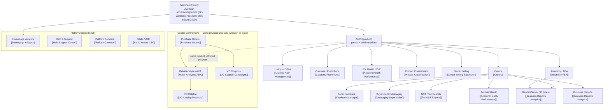

# Amazon — Data Model (how the sections join into one graph)

Amazon does not expose one relational schema; it exposes **two portals over the same physical
inventory of ASINs**. The join key that ties almost everything together is the **ASIN**
(child) / **parent-ASIN** and, on the 1P side, the **vendorGroupId**. This note maps how the 20
sections relate.

## The spine: ASIN → everything

## The join keys

| Key | Where it appears | Ties together |
|---|---|---|
| **ASIN** (`B0…`) | listings, inventory, orders, coupons, PCR, ARA | the product spine — the one id present in nearly every section |
| **parent ASIN** | listings variations, coupons (`asinCount`) | variation families |
| **merchantId** `A2V85Y00QGIGP9` | every 3P response (`merchantId`/`merchantAccountId`) | scopes all Seller Central data to Jivo Mart |
| **marketplaceId** `A21TJRUUN4KGV` | every 3P response | scopes to Amazon India |
| **vendorGroupId** `7691702`/`8592892` | ARA `amz-ara-custom-context`, PO responses | scopes all 1P data to a VC entity |
| **orderId** (`4NN-NNNNNNN-NNNNNNN`) | orders, messaging cases, feedback, GST MTR | one order across fulfilment → feedback → tax |
| **reportType** (`FBA_MYI_…`) | Report Central config + workflows | the 35 report catalogue |
| **campaignId / promotionId** (`obfuscatedPromotionId`) | coupons, VC coupons | a promotion and its metrics file |

## The two-portal duality

The same physical bottle of Jivo oil is:
- an **ASIN** in Seller Central (3P) — JIVO owns the listing, Amazon is the storefront; JIVO is
  paid by the customer (minus fees). Data: [[Orders]], [[Inventory-FBA]], [[Coupons-Promotions]].
- a **line on a Purchase Order** in Vendor Central (1P) — Amazon *buys* it from JIVO wholesale and
  owns the retail listing; JIVO is paid by Amazon. Data: [[Purchase-Orders]], [[Retail-Analytics-ARA]].

There is **no single endpoint that unifies 1P and 3P** — they are separate logins on separate
hosts. The unification happens only in JIVO's own downstream systems (SAP, the ecom hub). That is
why this study keeps the two portals as distinct section groups.

## Connections
- [[00-Amazon-Atlas]] · [[Amazon-Endpoints]] · [[Amazon-Data-Inventory]] · [[Amazon-Pages-and-Routes]] · [[Read-Only-Guardrails]]
