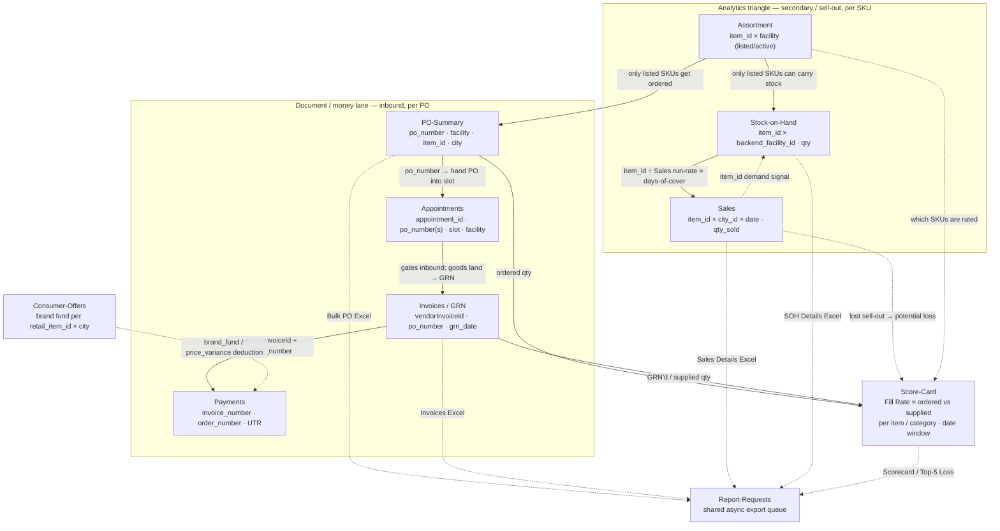

# Partner Portal — Data Model

How the the [[Partner-Hub]] (Partner-Hub) sections wire together for JIVO
(Jivo Wellness Pvt. Ltd., `x-entity-id=1117`, `x-entity-type=manufacturer`, internal
`manufacturer_id=176`). Every section is a view over the **same small set of business keys** —
PO number, facility, SKU/item, date, invoice id — so the portal reads as one relational graph,
not nine unrelated grids. This note maps that graph. It is grounded entirely in the section
notes ([[PO-Summary]], [[Invoices]], [[Payments]], [[Sales]], [[Stock-on-Hand]], [[Assortment]],
[[Score-Card]], [[Appointments]]) and the keys each one exposes; no live API was touched.

There are **two lanes** and two cross-cutting overlays:
1. **Document / money lane (primary, inbound):** [[PO-Summary]] → [[Appointments]] → [[Invoices]] → [[Payments]] — the physical + financial life of one purchase order.
2. **Analytics triangle (secondary, sell-out):** [[Sales]] ↔ [[Stock-on-Hand]] ↔ [[Assortment]] — the SKU-level demand/supply picture.
3. **[[Score-Card]]** rates how well the document lane is fulfilled (Fill Rate = ordered-vs-supplied), scored per SKU/category over a date window.
4. **[[Appointments]]** gates the document lane — no goods (and therefore no GRN/invoice) reach Blinkit until a PO's inbound delivery slot is booked.

## The join keys

The whole model reduces to six keys. Every arrow in the flowchart below is one of these.

| Key | Column names seen across sections | Joins |
|---|---|---|
| **PO number** | `po_number` (PO), `po_id`, `order_number` (Payments), `PO_NUMBER` (Invoices CSV), `po_numbers` (clubbed in Appointments) | [[PO-Summary]] ↔ [[Appointments]] ↔ [[Invoices]] ↔ [[Payments]] ↔ [[Score-Card]] |
| **Facility** | `facility_name` / `facility_id` (PO, Payments, Appointments), `backend_facility_name` / `backend_facility_id` (SOH) | [[PO-Summary]] ↔ [[Stock-on-Hand]] ↔ [[Assortment]] ↔ [[Appointments]] |
| **SKU / item** | `item_id` (Sales, SOH, PO items), `retail_item_id` (brand fund), `product_id` (Assortment, expected) | [[Sales]] ↔ [[Stock-on-Hand]] ↔ [[Assortment]] ↔ [[Score-Card]] ↔ brand-fund deductions |
| **Date** | `created_at` (Sales grid / SOH snapshot), `date` (Sales CSV), `grn_date` (Invoices), invoice/due/payment dates (Payments), `{start_date,end_date}` window (Score-Card), `issue_date`/`slot_date` (Appointments) | time-aligns every lane |
| **Invoice id** | `vendorInvoiceId` + `orderNumber` (invoice-detail route), `invoice_number` (Payments) | [[Invoices]] ↔ [[Payments]] (shared detail page `/app/invoice-details/:vendorInvoiceId/:orderNumber`) |
| **City** | `city_id` / `city_name` | [[Sales]] (per city) ↔ [[PO-Summary]] (delivery city) |

Two settlement-only keys ride on top: **UTR** (`payment_state`'s bank reference, the actual
money-movement id in [[Payments]]) and **appointment id** (`appointment_id` in [[Appointments]]).

## Flowchart

## The document / money lane (join key: PO number, then invoice id)

A single purchase order threads all four sections, joined first on **PO number**, then on **invoice id**:

1. **[[PO-Summary]]** — Blinkit raises a PO to JIVO. Grain: one PO (`po_number`) for a delivery
   `facility_name`/`city_name`, carrying line items (`item_id` × qty) and a lifecycle
   `po_state` (Created → Unscheduled → Scheduled → Delivered/Fulfilled). This is inbound demand:
   "what Blinkit ordered."
2. **[[Appointments]]** — the PO is handed into scheduling (branded "PO Scheduling"). Grain: one
   `appointment_id` binding one or more `po_number`s (clubbing) to a delivery `slot_time` at a
   `facility_name`. **This gates the lane** — no goods dispatch, hence no GRN, until the slot is
   booked and the appointment reaches `FULFILLED`. The PO-picker inside the wizard reuses
   `client-po-details` from [[PO-Summary]], so the join is literally the same `po_number`.
3. **[[Invoices]]** — once goods arrive against the appointment, Blinkit books a **GRN** and the
   vendor invoice. Grain: one invoice (`vendorInvoiceId`) against its `po_number`/`orderNumber`,
   dated by `grn_date`, split into All / GRN / Discrepancy line items (ordered-vs-received delta).
   This is "what was received/booked." Join back to the PO on `PO_NUMBER`; forward to Payments on
   the shared invoice-detail route `/app/invoice-details/:vendorInvoiceId/:orderNumber`.
4. **[[Payments]]** — the settlement view of the *same* invoices (grouped under
   `category:"payments"`). Grain: one invoice (`invoice_number` / `order_number`) with the money
   ladder Invoice Amount → GRN Amount → Discrepancy → Approved → **Deductions** {brand fund, price
   variance} → **Net Payable**, a `payment_state` (PAID/PENDING) and a **UTR** settlement id.
   [[Invoices]] and Payments are two faces of one object joined on **invoice id + PO number**:
   Invoices shows the goods/GRN face, Payments the payout face.

**Deduction trace.** The `brand_fund` deduction on a Payments row traces back to promotional
co-funding committed in [[Consumer-Offers]] (brand fund per `retail_item_id` × city), closing a
loop from promo commitment → invoice deduction → net payout.

## The analytics triangle (join key: SKU/item, with facility and city)

Three SKU-level views share **`item_id`** and pivot on facility vs city:

- **[[Assortment]]** — which SKUs are **listed/active per facility**. This is the SKU *universe*:
  it governs what can be ordered on a PO and what can hold stock. Grain: `item_id` (product) ×
  facility × status(listed/active).
- **[[Stock-on-Hand]]** — the **live inventory snapshot** at Blinkit facilities. Grain: one row
  per `item_id` × `backend_facility_id`, carrying `backend_inv_qty` + `frontend_inv_qty` as of a
  `created_at` timestamp. Conceptually **SOH ≈ Assortment ∩ has-inventory** — only listed SKUs
  can appear.
- **[[Sales]]** — **sell-out** to consumers. Grain: `item_id` × `city_id` × `date` (the CSV adds
  true daily `date`; the on-screen grid aggregates without it), carrying `qty_sold` + `mrp`.

The triangle's core computation: **SOH (units held) ÷ Sales run-rate = days-of-cover /
stock-out risk**, joined on `item_id`. [[Assortment]] sits above both as the gate — de-list a SKU
and it drops out of SOH and (eventually) Sales. The triangle also feeds the document lane:
**only listed SKUs get POs** ([[Assortment]] → [[PO-Summary]]), and **low SOH at a facility is
what a replenishment PO refills** ([[Stock-on-Hand]] → [[PO-Summary]]).

## Overlays

**[[Score-Card]] rates fulfilment.** Its headline metric, **Fill Rate**, is exactly the
document-lane join made quantitative: **ordered qty (from [[PO-Summary]]) vs supplied/GRN'd qty
(from [[Invoices]])**, aggregated per `item_id`/category over a `{start_date, end_date}` window.
Its "Top-5 Potential Loss" panel ties poor fill-rate SKUs to lost [[Sales]] sell-out, and
[[Assortment]] determines which SKUs are eligible to be rated. Read-only analytics — no data
entry.

**[[Appointments]] gates inbound.** Structurally it sits **between [[PO-Summary]] and
[[Invoices]]**: a PO cannot become a GRN/invoice until its inbound slot is booked. It shares the
PO reads (`client-po-details`, `get-grn-details`) with the document lane and the `facility_name`
join with SOH/Assortment, and it attaches invoices to a scheduled appointment
(`fetch-invoice`) — the same `vendorInvoiceId` that flows on to Payments.

**Shared export spine — [[Report-Requests]].** Bulk exports from [[PO-Summary]] (Bulk PO Excel),
[[Invoices]] (Invoices Excel), [[Sales]] (Sales Details Excel), [[Stock-on-Hand]] (SOH Details
Excel) and [[Score-Card]] (Scorecard / Top-5 Potential Loss) all land in one async queue
(`POST /v1/report-requests/` → `download//{id}/` → presigned S3). Not a business join, but the
common plumbing every section falls back to. [[Appointments]] is the exception — it uses its own
`vendor_appointment/api/*` bulk-upload path rather than the shared queue.

## Grain summary (one row means…)

| Section | One row = | Primary key(s) | Time key |
|---|---|---|---|
| [[PO-Summary]] | one purchase order (header) | `po_number` | `po_issue_date` / `po_expiry_date` |
| [[PO-Summary]] items | one SKU on a PO | `po_number` × `item_id` | — |
| [[Appointments]] | one delivery appointment | `appointment_id` (→ `po_number(s)`) | `slot_date` / `slot_time` |
| [[Invoices]] | one invoice / GRN vs a PO | `vendorInvoiceId` (× `po_number`) | `grn_date` |
| [[Payments]] | one invoice's payout | `invoice_number` (× `order_number`) → **UTR** | invoice / due / payment date |
| [[Sales]] | sell-out of a SKU in a city on a day | `item_id` × `city_id` × `date` | `date` / `created_at` |
| [[Stock-on-Hand]] | stock of a SKU at a facility | `item_id` × `backend_facility_id` | `created_at` (snapshot) |
| [[Assortment]] | a SKU's listing at a facility | `item_id`/`product_id` × facility | — (state) |
| [[Score-Card]] | a fill-rate/rank metric | `item_id`/category over window | `{start_date,end_date}` |

## Connections

- Portal shell & nav: [[Partner-Hub]] · index: [[00-Blinkit-Atlas]]
- Document / money lane: [[PO-Summary]] → [[Appointments]] → [[Invoices]] → [[Payments]]
- Analytics triangle: [[Sales]] ↔ [[Stock-on-Hand]] ↔ [[Assortment]]
- Overlays: [[Score-Card]] (fulfilment rating) · [[Appointments]] (inbound gate) · [[Consumer-Offers]] (brand-fund deductions)
- Shared export spine: [[Report-Requests]] · EDI/document siblings: [[EDI-Integration]]
