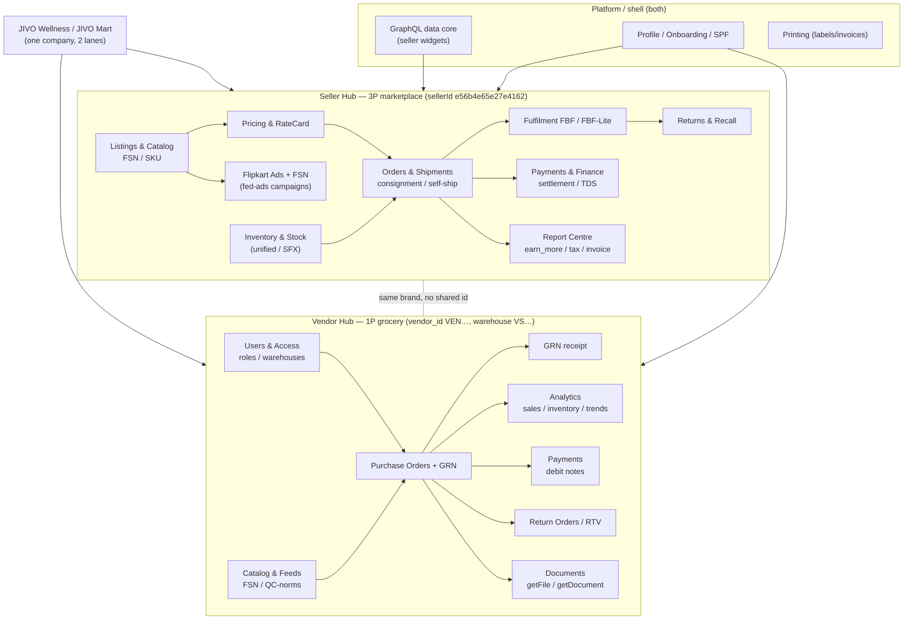

# Flipkart — Data Model (how the sections join)

Two independent business graphs behind one brand, joined only at the JIVO-entity level (the same
company sells 3P via Seller Hub and 1P via Vendor Hub). They do **not** share IDs: Seller Hub keys
on `sellerId` + `FSN`/`SKU ID`; Vendor Hub keys on `vendor_id` (`VEN…`) + `FSN` + warehouse
(`VS…`).

## Join keys

| Concept | Seller Hub | Vendor Hub |
|---|---|---|
| Account | `sellerId` (`e56b4e65e27e4162`) | `vendor_id` (`VEN23097` …) under an `accountId` (`ACC…`) |
| Product | `FSN`, `SKU ID`, `listingId` | `FSN`, `sku_id` |
| Location | fulfilment `Location Id` / warehouse | vendor site `VS…` (warehouse) |
| Order | consignment id / shipment id | PO number → GRN id |
| Money | settlement / payment id | debit-note id / invoice id |
| Report | `request_id` (report-centre) | `document_id` (`CONA…`) / getDocument token |

## Lifecycles

- **Seller 3P sale:** Listing (FSN) → Price set → Customer order → Shipment (self-ship / FBF) →
  Delivered or Return/RTO → Settlement/Payment → captured in Report Centre + Ads attribution.
- **Vendor 1P supply:** Flipkart raises **PO** to a JIVO vendor → JIVO ships → **GRN** at the FK
  warehouse → sales/inventory analytics → debit notes / returns (RTV) → payment.

Both lifecycles are **read-only** in this study; every state-changing transition
(accept/dispatch/approve/settle/upload) is catalogued out-of-scope in the section notes and
[[Flipkart-Endpoints]].

## Connections
[[00-Flipkart-Atlas]] · [[Flipkart-Endpoints]] · [[Flipkart-Data-Inventory]] · [[Auth-and-Access]]
