# Flipkart — Live Read-Only Walk (screenshots + on-screen evidence)

Per-section screenshots + page text captured by a read-only browser walk on 2026-07-30 (headless Chrome on `HO-IT-PC10`, session consumed not minted — G9; navigation only, no clicks; write-verb/auth requests aborted before the socket). Each image is a **distinct, non-trivial** page (byte-identical AND same-content duplicates were dropped at ingest). Raw per-page network capture (`sec-*.json`) is kept local (gitignored) as it carries response bodies; the screenshot + page text are the committed evidence.

Amendment-04 audit of application-fired non-GET requests: `captures/nonget-allowed.tsv` (+ `nonget-flagged.tsv`). All were reads/telemetry — no mutation (no clicks were made).

## Vendor Hub (13 sections)

### sec-01-vh-home-dashboard

`https://vendorhub.flipkart.com/` → https://vendorhub.flipkart.com/#/vendor-portal/home

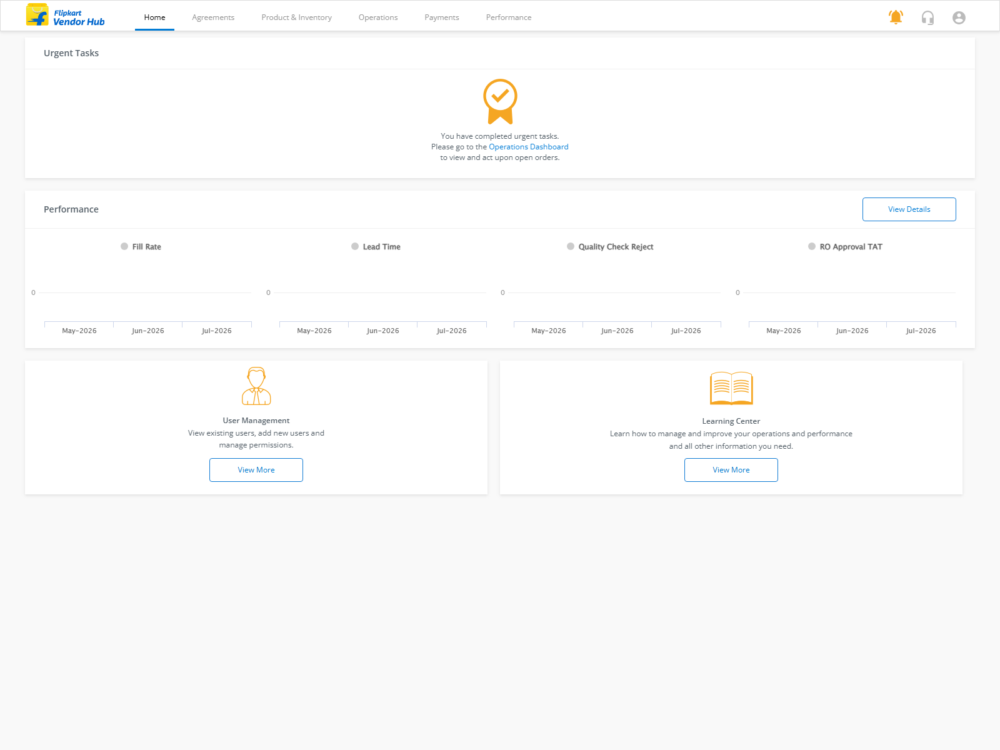

> Home Agreements Product & Inventory Operations Payments Performance Vendor Recon Tool Urgent Tasks You have completed urgent tasks. Please go to the Operations Dashboard to view and act upon open orders. Performance View Details Fill Rate M

### sec-02-vh-operations-po-new

`https://vendorhub.flipkart.com/#/operations/po/list?status=new`

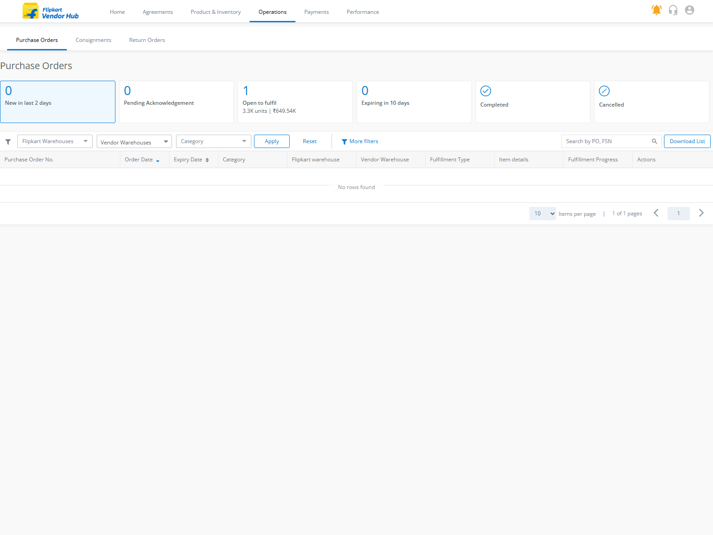

> Home Agreements Product & Inventory Operations Payments Performance Purchase Orders Consignments Return Orders Purchase Orders 0 New in last 2 days 0 Pending Acknowledgement 1 Open to fulfil 3.3K units | 649.54K 0 Expiring in 10 days Comple

### sec-03-vh-operations-po-open

`https://vendorhub.flipkart.com/#/operations/po/list?status=open`

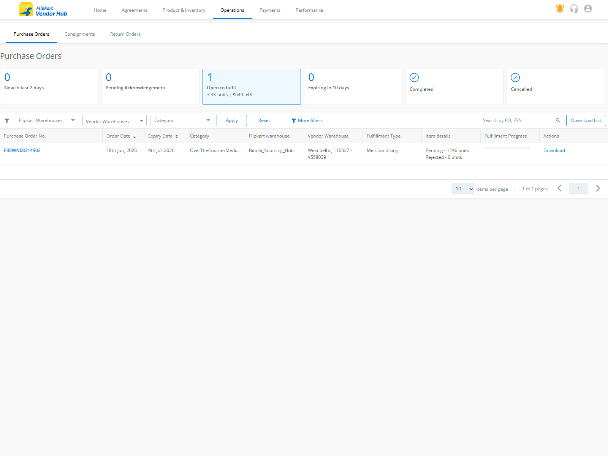

> Home Agreements Product & Inventory Operations Payments Performance Purchase Orders Consignments Return Orders Purchase Orders 0 New in last 2 days 0 Pending Acknowledgement 1 Open to fulfil 3.3K units | 649.54K 0 Expiring in 10 days Comple

### sec-05-vh-operations-po-completed

`https://vendorhub.flipkart.com/#/operations/po/list?status=completed`

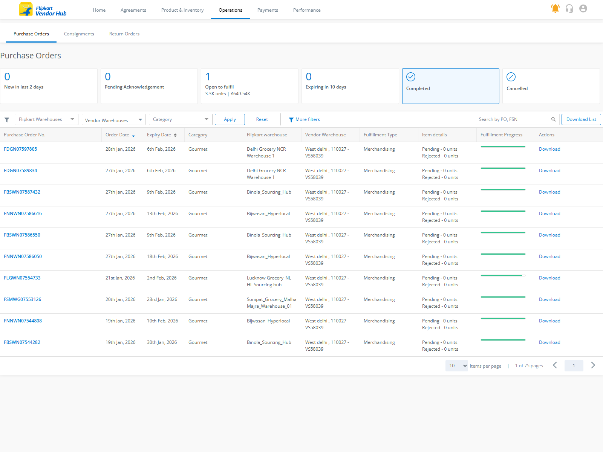

> Home Agreements Product & Inventory Operations Payments Performance Purchase Orders Consignments Return Orders Purchase Orders 0 New in last 2 days 0 Pending Acknowledgement 1 Open to fulfil 3.3K units | 649.54K 0 Expiring in 10 days Comple

### sec-06-vh-operations-po-cancelled

`https://vendorhub.flipkart.com/#/operations/po/list?status=cancelled`

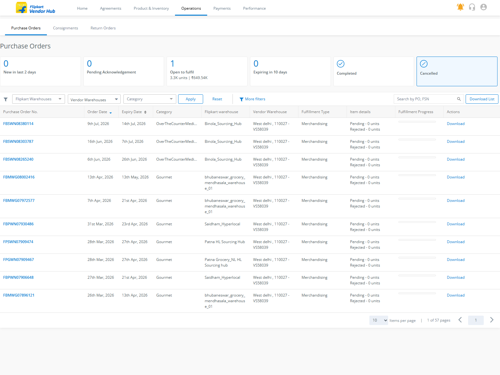

> Home Agreements Product & Inventory Operations Payments Performance Purchase Orders Consignments Return Orders Purchase Orders 0 New in last 2 days 0 Pending Acknowledgement 1 Open to fulfil 3.3K units | 649.54K 0 Expiring in 10 days Comple

### sec-07-vh-operations-consignments

`https://vendorhub.flipkart.com/#/operations/consignments`

> Home Agreements Product & Inventory Operations Payments Performance Purchase Orders Consignments Return Orders

### sec-09-vh-inventory-analytics-product-details

`https://vendorhub.flipkart.com/#/vendor-portal/inventory/landing/analytics/product-details/list`

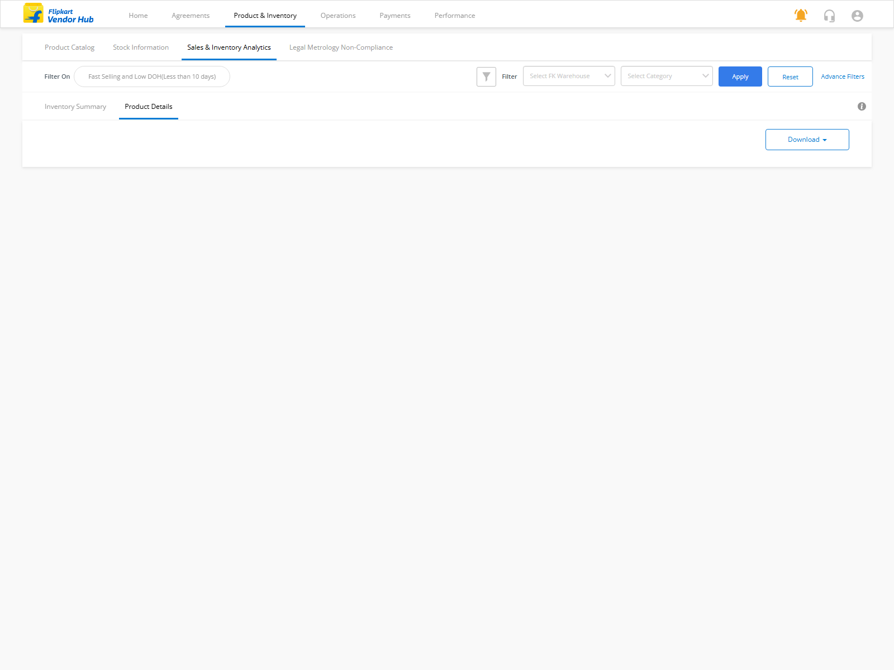

> Home Agreements Product & Inventory Operations Payments Performance Vendor Recon Tool Product Catalog Stock Information Sales & Inventory Analytics Legal Metrology Non-Compliance Filter On Fast Selling and Low DOH(Less than 10 days) Filter 

### sec-12-vh-agreements

`https://vendorhub.flipkart.com/#/agreements` → https://vendorhub.flipkart.com/#/agreements/buying-contracts/vendor-sites

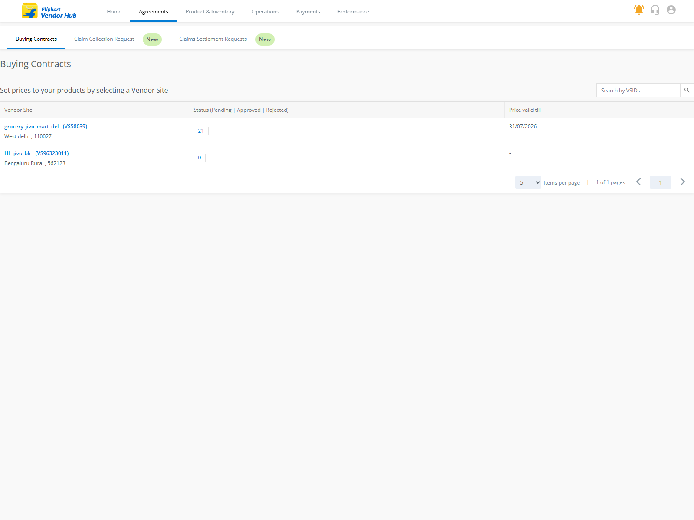

> Home Agreements Product & Inventory Operations Payments Performance Buying Contracts Claim Collection Request New Claims Settlement Requests New Buying Contracts Set prices to your products by selecting a Vendor Site Vendor Site Status (Pen

### sec-13-vh-agreements-brand-offer

`https://vendorhub.flipkart.com/#/agreements/brand-offer` → https://vendorhub.flipkart.com/#/agreements/brand-offer/offer-view?tab=pendingApproval

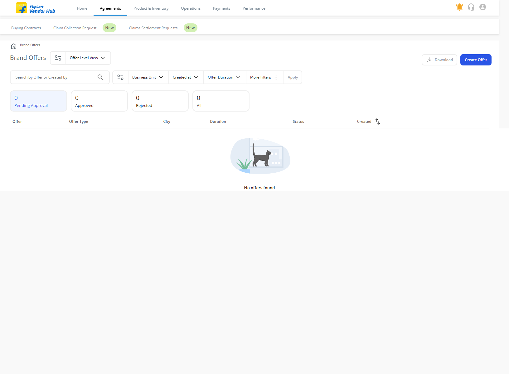

> Home Agreements Product & Inventory Operations Payments Performance Buying Contracts Claim Collection Request New Claims Settlement Requests New Brand Offers Brand Offers Offer Level View Download Create Offer Business Unit Created at Offer

### sec-14-vh-agreements-claims

`https://vendorhub.flipkart.com/#/agreements/claims-collection-request-management`

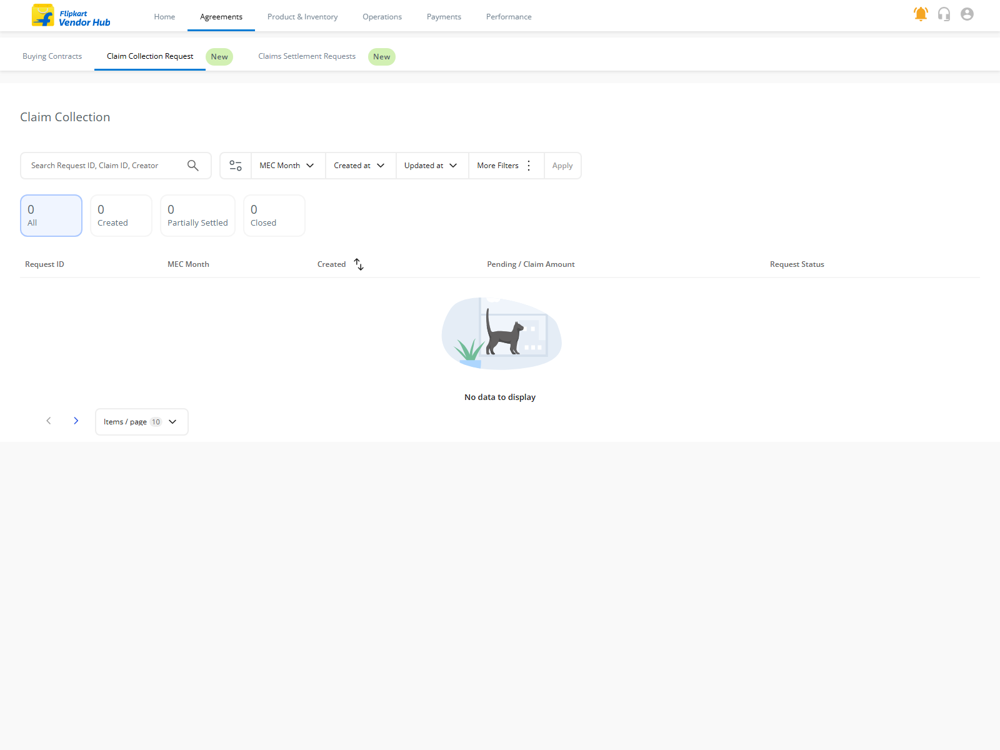

> Home Agreements Product & Inventory Operations Payments Performance Buying Contracts Claim Collection Request New Claims Settlement Requests New Claim Collection MEC Month Created at Updated at More Filters Apply 0 All 0 Created 0 Partially

### sec-15-vh-payments

`https://vendorhub.flipkart.com/#/payments` → https://vendorhub.flipkart.com/#/payments/invoices?status=paid

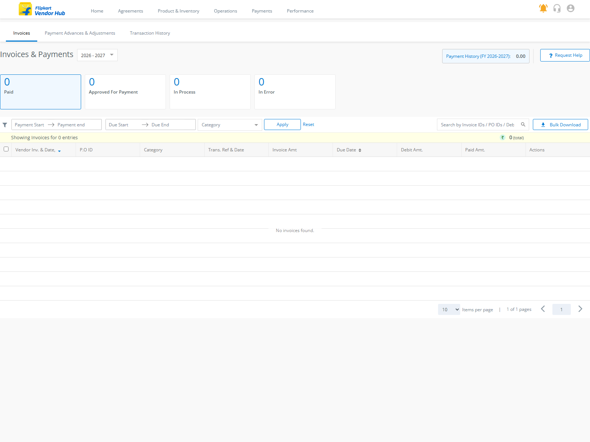

> Home Agreements Product & Inventory Operations Payments Performance Invoices Payment Advances & Adjustments Transaction History Invoices & Payments 2026 - 2027 Payment History (FY 2026-2027):0.00 Request Help 0 Paid 0 Approved For Payment 0

### sec-16-vh-payments-debit-notes

`https://vendorhub.flipkart.com/#/payments/debit-notes`

> Home Agreements Product & Inventory Operations Payments Performance Invoices Payment Advances & Adjustments Transaction History

### sec-18-vh-profile

`https://vendorhub.flipkart.com/#/profile`

> Home Agreements Product & Inventory Operations Payments Performance

## Seller Hub (24 sections)

### sec-01-sh-home

`https://seller.flipkart.com/index.html#dashboard/home-page`

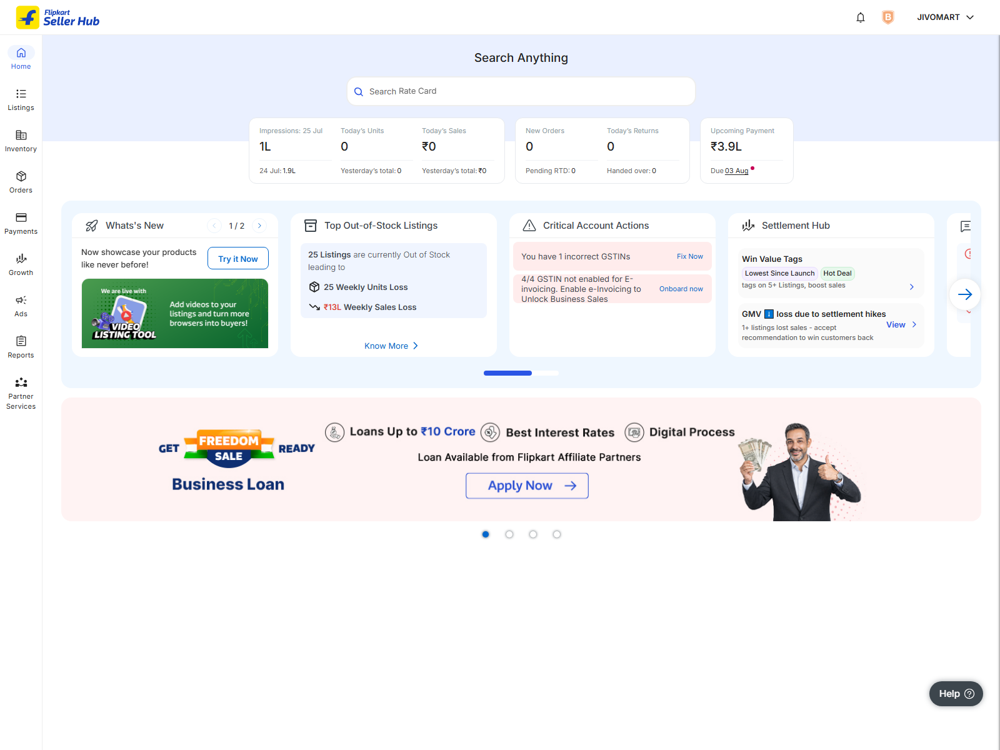

> Connect with Buyers Loading.. JIVOMART Home Listings Inventory Orders Payments Growth Ads Reports Partner Services Help Search Anything Search Rate Card FSN Impressions: 25 Jul 1L 24 Jul: 1.9L Today’s Units 0 Yesterday’s total: 0 Today’s Sa

### sec-02-sh-listings-active

`https://seller.flipkart.com/index.html#dashboard/listings-management?listingState=ACTIVE`

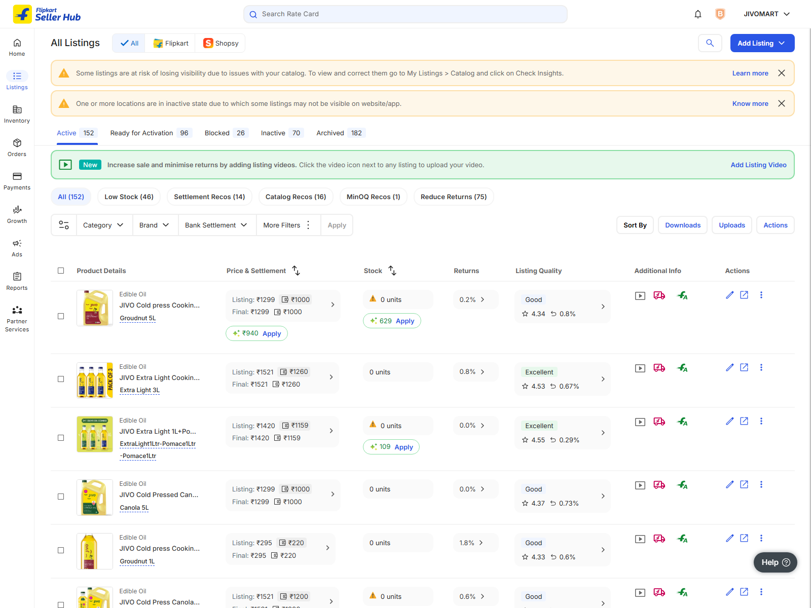

> Connect with Buyers Loading.. Search Rate Card FSN JIVOMART Home Listings Inventory Orders Payments Growth Ads Reports Partner Services Help All Listings All Flipkart Shopsy Add Listing Some listings are at risk of losing visibility due to 

### sec-03-sh-listings-inactive

`https://seller.flipkart.com/index.html#dashboard/listings-management?listingState=INACTIVE`

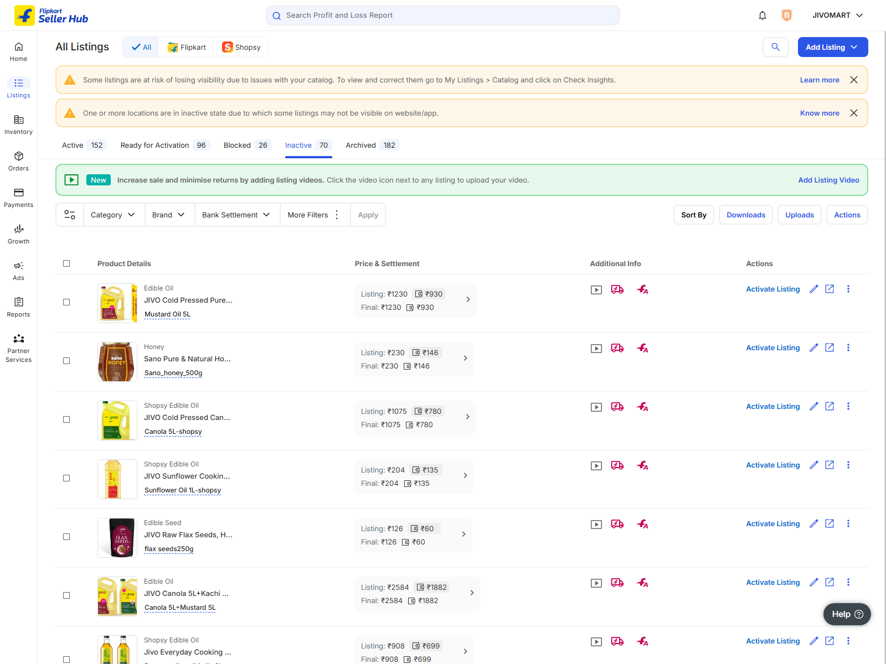

> Connect with Buyers Loading.. Search Profit and Loss Report LID JIVOMART Home Listings Inventory Orders Payments Growth Ads Reports Partner Services Help All Listings All Flipkart Shopsy Add Listing Some listings are at risk of losing visib

### sec-04-sh-listings-archived

`https://seller.flipkart.com/index.html#dashboard/listings-management?listingState=ARCHIVED`

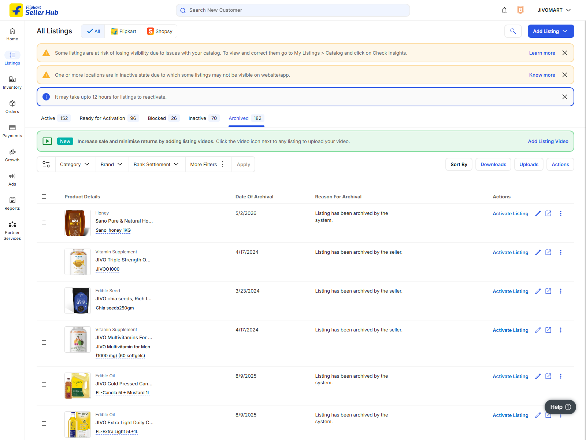

> Connect with Buyers Loading.. Search New Customer Profit and Loss Report JIVOMART Home Listings Inventory Orders Payments Growth Ads Reports Partner Services Help All Listings All Flipkart Shopsy Add Listing Some listings are at risk of los

### sec-05-sh-listings-in-progress

`https://seller.flipkart.com/index.html#dashboard/listingsInProgress` → https://seller.flipkart.com/index.html#dashboard/listingsInProgress?filters=%7B%22statusFilter%22%3A%7B%22checked%22%3A%5B%5D%7D%2C%22categoryFilter%22%3A%7B%22checked%22%3A%5B%5D%7D%2C%22marketplaceFilter%22%3A%7B%22checked%22%3A%5B%22FLIPKART%22%5D%7D%2C%22search%22%3A%22%22%2C%22bulkTypeIndex%22%3A0%2C%22requestType%22%3A%22cpui%22%2C%22listingType%22%3A%22single%22%2C%22epuiStatus%22%3A%22%22%2C%22searchType%22%3A%22%22%7D

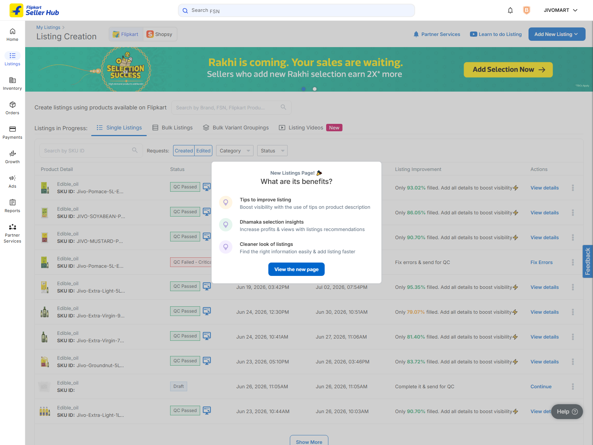

> Connect with Buyers Loading.. Search Rate Card FSN JIVOMART Home Listings Inventory Orders Payments Growth Ads Reports Partner Services Help My Listings Listing Creation Flipkart Shopsy Introducing Shopsy Returns honge kam Do you want to re

### sec-06-sh-inventory

`https://seller.flipkart.com/index.html#dashboard/unifiedInventoryNew` → https://seller.flipkart.com/index.html#dashboard/unifiedInventoryNew?ffType=NON_FBF&location=LOCd11c4c8929a44e208e29b98274763dfd&state=low_stock

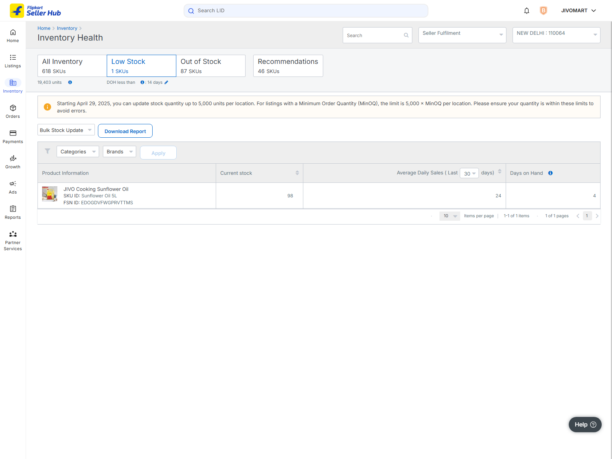

> Connect with Buyers Loading.. Search LID Rate Card JIVOMART Home Listings Inventory Orders Payments Growth Ads Reports Partner Services Help HomeInventory Inventory Health Seller Fulfilment NEW DELHI : 110064 All Inventory 618SKUs Low Stock

### sec-07-sh-inventory-health

`https://seller.flipkart.com/index.html#dashboard/inventoryHealth` → https://seller.flipkart.com/index.html#dashboard/page-not-found

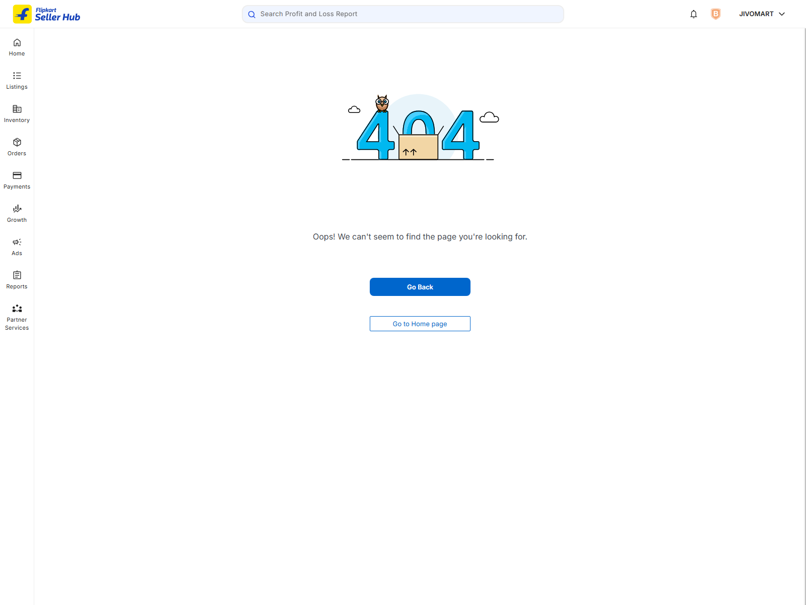

> Connect with Buyers Loading.. Search Profit and Loss Report LID JIVOMART Home Listings Inventory Orders Payments Growth Ads Reports Partner Services Oops! We can't seem to find the page you're looking for. Go Back Go to Home page

### sec-08-sh-orders-to-pack

`https://seller.flipkart.com/index.html#dashboard/my-orders?serviceProfile=seller-fulfilled&shipmentType=easy-ship&orderState=shipments_to_pack` → https://seller.flipkart.com/index.html#dashboard/active-orders?query=%7B%22activeShipmentTile%22%3A%22pendingToAccept%22%7D

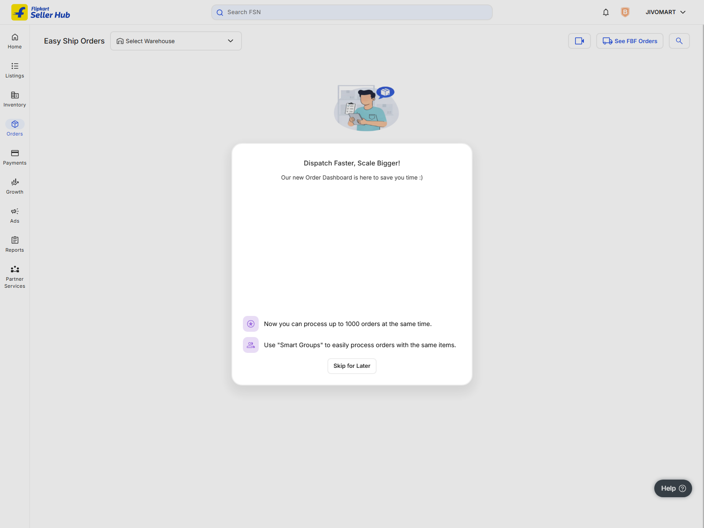

> Connect with Buyers Loading.. Search FSN New Customer JIVOMART Home Listings Inventory Orders Payments Growth Ads Reports Partner Services Help Easy Ship Orders Select Warehouse See FBF Orders Select a warehouse to get started View and mana

### sec-09-sh-orders-upcoming

`https://seller.flipkart.com/index.html#dashboard/my-orders?orderState=upcoming` → https://seller.flipkart.com/index.html#dashboard/active-orders?query=%7B%7D

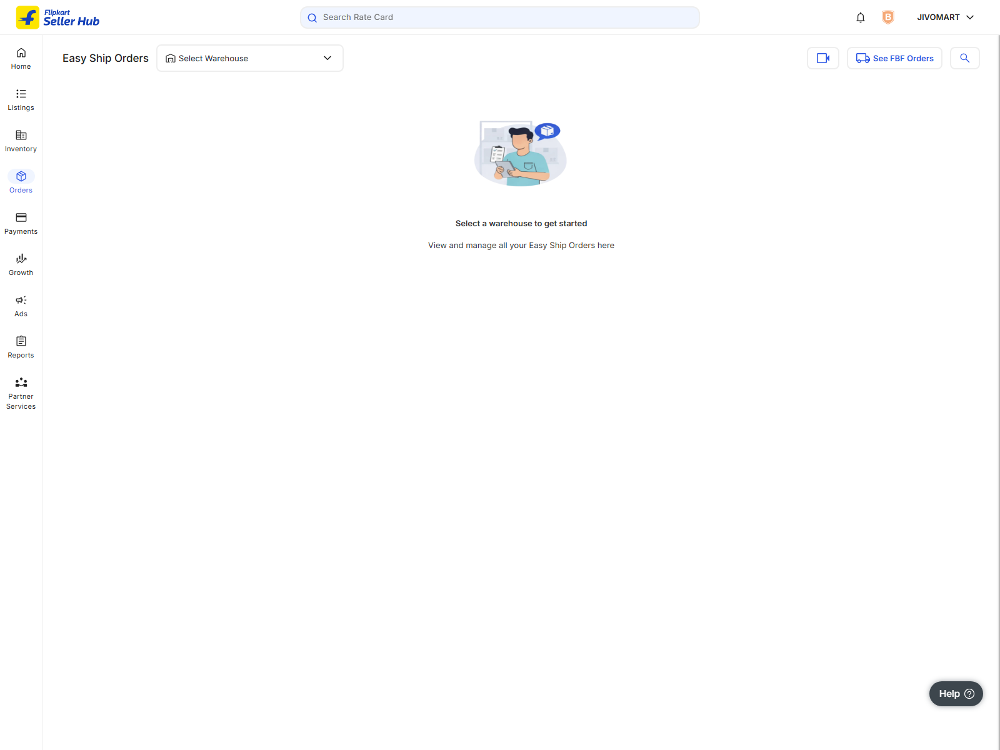

> Connect with Buyers Loading.. Search Rate Card FSN JIVOMART Home Listings Inventory Orders Payments Growth Ads Reports Partner Services Help Easy Ship Orders Select Warehouse See FBF Orders Select a warehouse to get started View and manage 

### sec-10-sh-orders-cancelled

`https://seller.flipkart.com/index.html#dashboard/my-orders?orderState=cancelled` → https://seller.flipkart.com/index.html#dashboard/active-orders?query=%7B%7D

> Connect with Buyers Loading.. Search Profit and Loss Report LID JIVOMART Home Listings Inventory Orders Payments Growth Ads Reports Partner Services Help Easy Ship Orders Select Warehouse See FBF Orders Select a warehouse to get started Vie

### sec-11-sh-returns

`https://seller.flipkart.com/index.html#dashboard/returns`

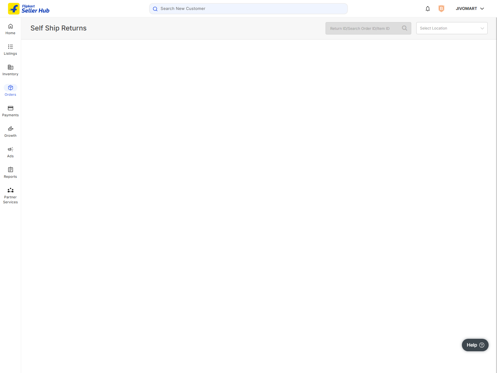

> Connect with Buyers Loading.. Search New Customer Profit and Loss Report JIVOMART Home Listings Inventory Orders Payments Growth Ads Reports Partner Services Help Select Location Self Ship Returns

### sec-12-sh-payments-account-summary

`https://seller.flipkart.com/index.html#dashboard/payments/account-summary` → https://seller.flipkart.com/index.html#dashboard/payments/account-summary?query=%7B%22upcoming_payment%22%3A%222026-08-03%22%2C%22previous_payment%22%3A%222026-07-29%22%7D

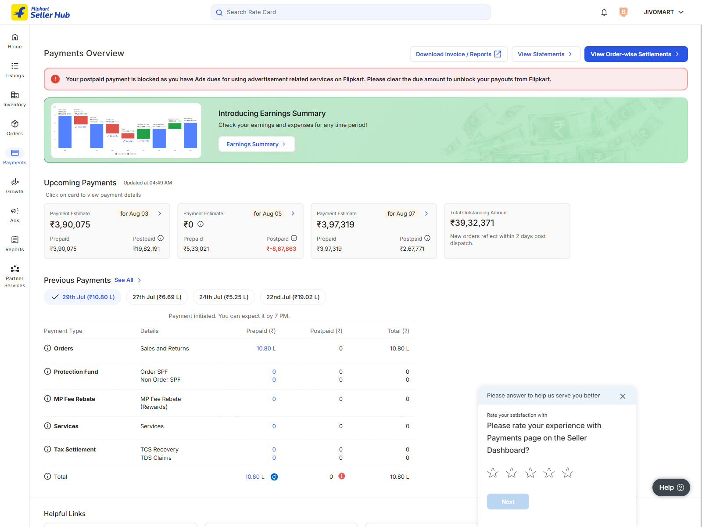

> Connect with Buyers Loading.. Please answer to help us serve you better Rate your satisfaction with Please rate your experience with Payments page on the Seller Dashboard? ★ ★ ★ ★ ★ Next Search Rate Card FSN JIVOMART Home Listings Inventory

### sec-13-sh-payments

`https://seller.flipkart.com/index.html#dashboard/payments` → https://seller.flipkart.com/index.html#dashboard/page-not-found

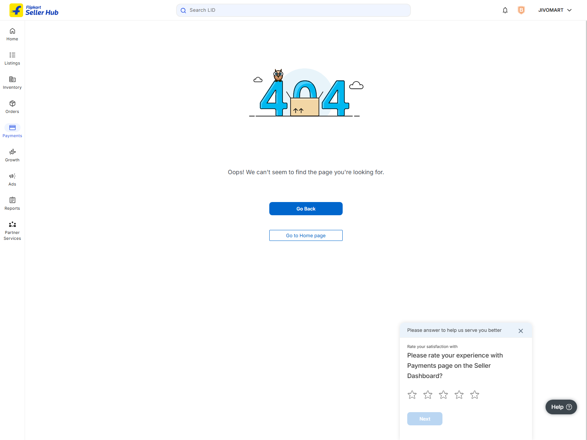

> Connect with Buyers Loading.. Please answer to help us serve you better Rate your satisfaction with Please rate your experience with Payments page on the Seller Dashboard? ★ ★ ★ ★ ★ Next Search LID Rate Card JIVOMART Home Listings Inventory

### sec-14-sh-report-centre

`https://seller.flipkart.com/index.html#dashboard/metrics/report-centre`

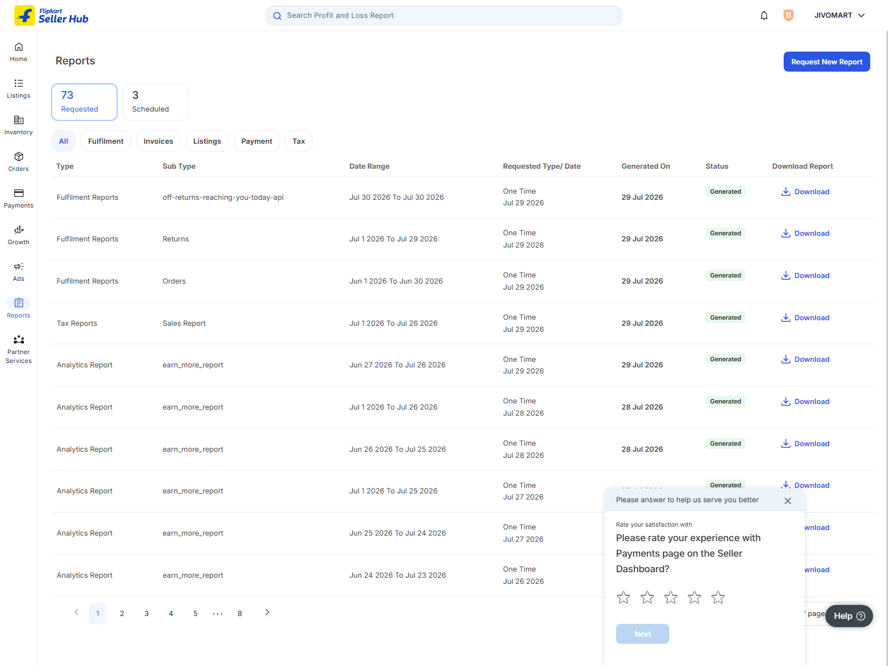

> Connect with Buyers Loading.. Please answer to help us serve you better Rate your satisfaction with Please rate your experience with Payments page on the Seller Dashboard? ★ ★ ★ ★ ★ Next Search New Customer Profit and Loss Report JIVOMART H

### sec-15-sh-pricing-central

`https://seller.flipkart.com/index.html#dashboard/metrics/pricing-recommendations/pricing-central` → https://seller.flipkart.com/index.html#dashboard/metrics/pricing-recommendations/pricing-central?source=nav-menu&page&tag=losing_to_competition&model=top_listings&listId=undefined

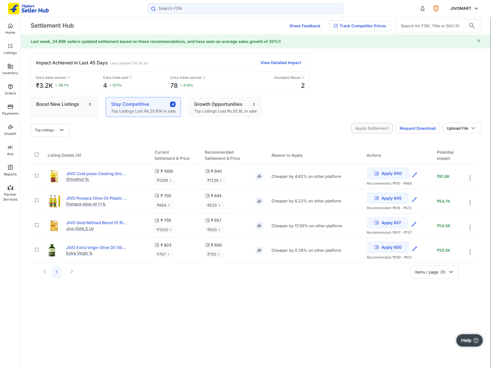

> Connect with Buyers Loading.. Search FSN New Customer JIVOMART Home Listings Inventory Orders Payments Growth Ads Reports Partner Services Help Settlement Hub Share Feedback Track Competitor Prices Last week, 24.89K sellers updated settleme

### sec-16-sh-ads-campaigns

`https://seller.flipkart.com/index.html#dashboard/ads/campaigns`

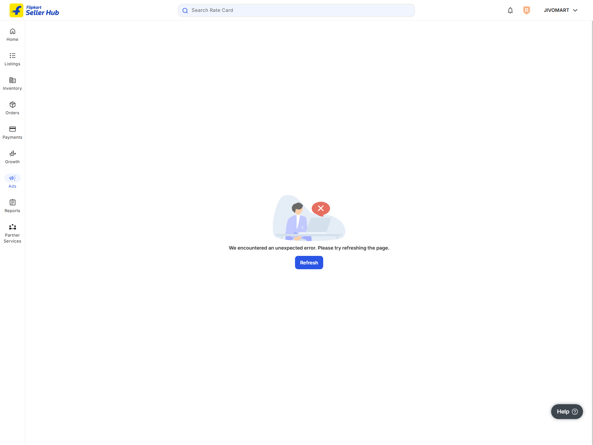

> Connect with Buyers Loading.. Search Rate Card FSN JIVOMART Home Listings Inventory Orders Payments Growth Ads Reports Partner Services Help We encountered an unexpected error. Please try refreshing the page. Refresh Header

### sec-17-sh-growth-insights

`https://seller.flipkart.com/index.html#dashboard/growth/seller-insights` → https://seller.flipkart.com/index.html#dashboard/growth/seller-insights?section=overview

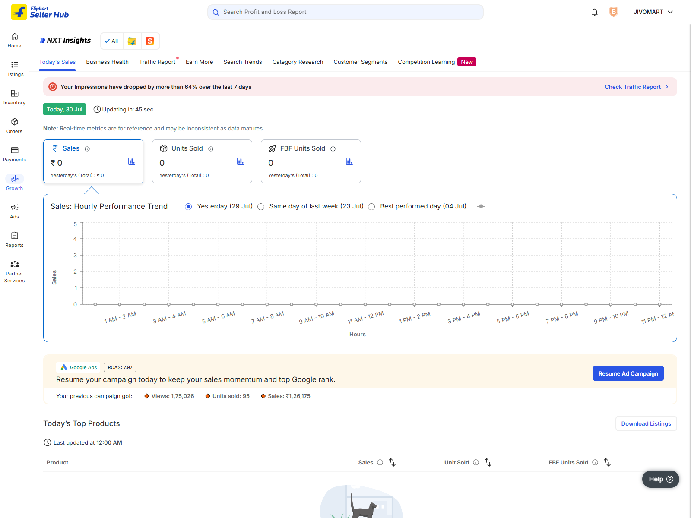

> Connect with Buyers Loading.. Search Profit and Loss Report LID JIVOMART Home Listings Inventory Orders Payments Growth Ads Reports Partner Services Help All Today's Sales Business Health Traffic Report Earn More Search Trends Category Rese

### sec-18-sh-lending

`https://seller.flipkart.com/index.html#dashboard/lending?page=LANDING`

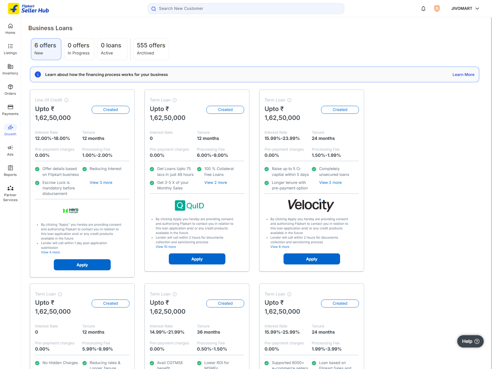

> Connect with Buyers Loading.. Search New Customer Profit and Loss Report JIVOMART Home Listings Inventory Orders Payments Growth Ads Reports Partner Services Help Business Loans 6 offers New 0 offers In Progress 0 loans Active 555 offers Ar

### sec-19-sh-partner-services

`https://seller.flipkart.com/index.html#dashboard/partner-services/home`

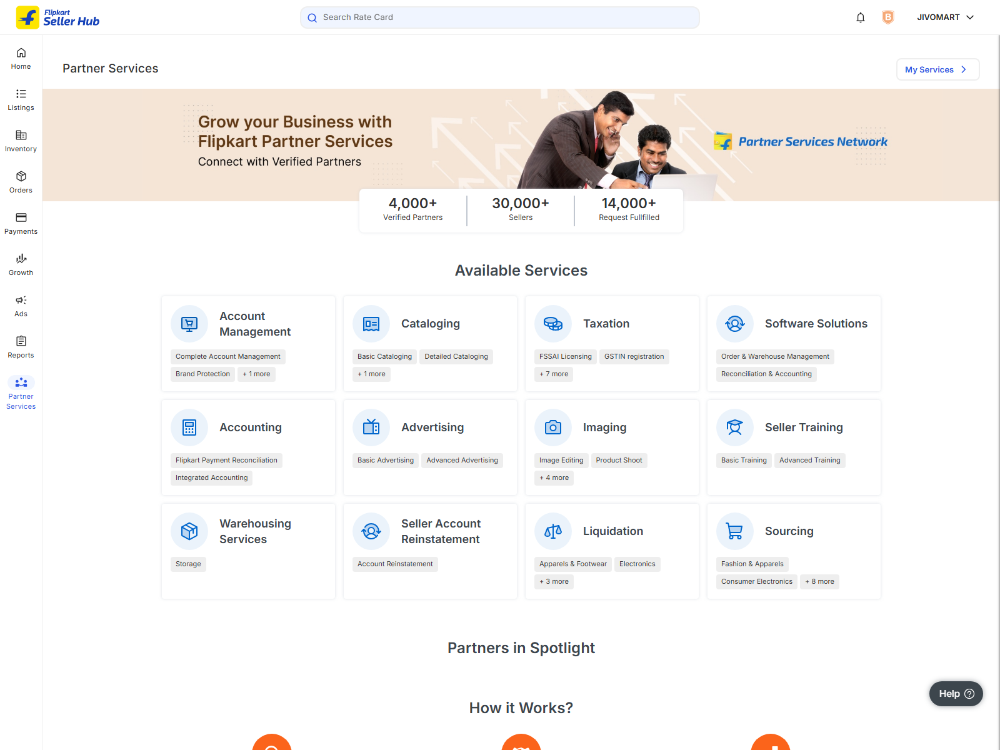

> Connect with Buyers Loading.. Search Rate Card FSN JIVOMART Home Listings Inventory Orders Payments Growth Ads Reports Partner Services Help Partner Services My Services 4,000+ Verified Partners 30,000+ Sellers 14,000+ Request Fullfilled Av

### sec-20-sh-ratecard

`https://seller.flipkart.com/index.html#dashboard/rateCard` → https://seller.flipkart.com/index.html#dashboard/page-not-found

> Connect with Buyers Loading.. Search LID Rate Card JIVOMART Home Listings Inventory Orders Payments Growth Ads Reports Partner Services Oops! We can't seem to find the page you're looking for. Go Back Go to Home page 12 AM - 1 AM

### sec-21-sh-promotions

`https://seller.flipkart.com/index.html#dashboard/promotions` → https://seller.flipkart.com/index.html#dashboard/page-not-found

> Connect with Buyers Loading.. Search New Customer Profit and Loss Report JIVOMART Home Listings Inventory Orders Payments Growth Ads Reports Partner Services Oops! We can't seem to find the page you're looking for. Go Back Go to Home page 1

### sec-22-sh-seller-qna

`https://seller.flipkart.com/index.html#dashboard/sellerQnA` → https://seller.flipkart.com/index.html#dashboard/page-not-found

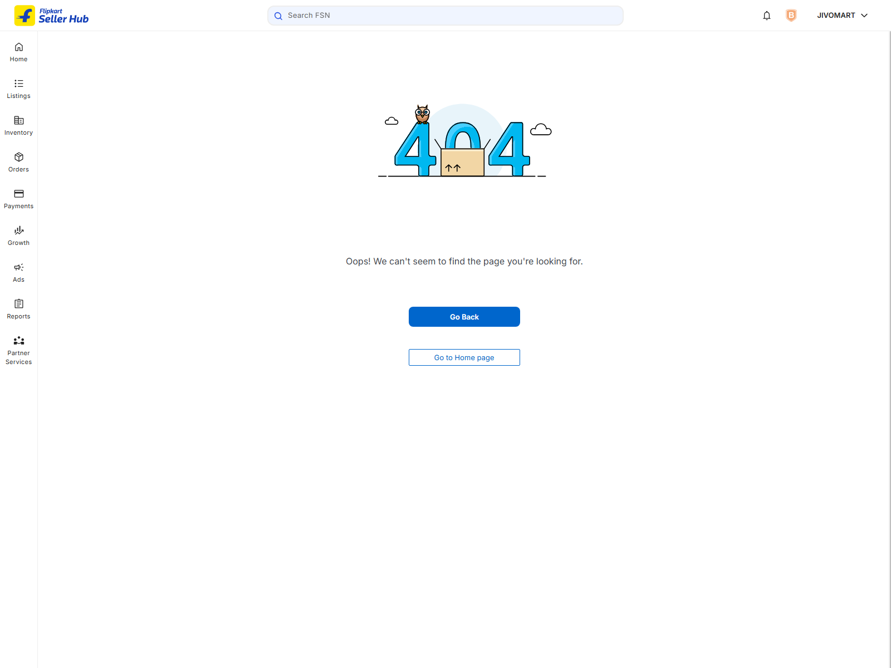

> Connect with Buyers Loading.. Search FSN New Customer JIVOMART Home Listings Inventory Orders Payments Growth Ads Reports Partner Services Oops! We can't seem to find the page you're looking for. Go Back Go to Home page 12 AM - 1 AM

### sec-23-sh-notifications

`https://seller.flipkart.com/index.html#dashboard/notifications`

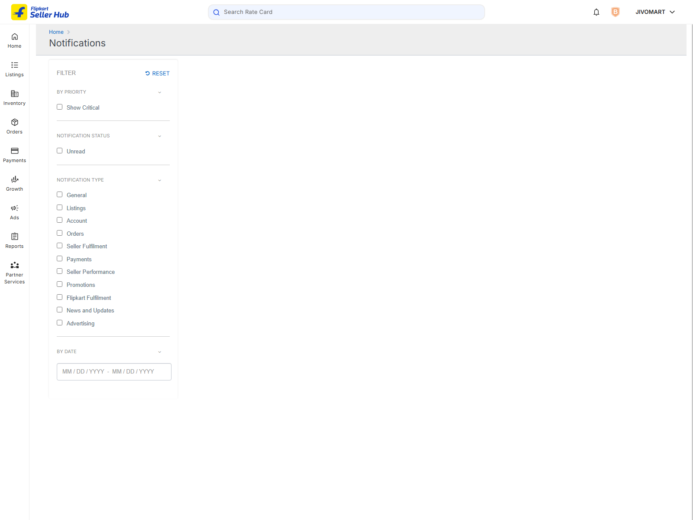

> Connect with Buyers Loading.. Search LID Rate Card JIVOMART Home Listings Inventory Orders Payments Growth Ads Reports Partner Services Home Notifications FILTER RESET BY PRIORITY Show Critical NOTIFICATION STATUS Unread NOTIFICATION TYPE G

### sec-24-sh-cancellations-insights

`https://seller.flipkart.com/index.html#dashboard/cancellations-insights` → https://seller.flipkart.com/index.html#dashboard/page-not-found

> Connect with Buyers Loading.. Search Profit and Loss Report LID JIVOMART Home Listings Inventory Orders Payments Growth Ads Reports Partner Services Oops! We can't seem to find the page you're looking for. Go Back Go to Home page 12 AM - 1 
