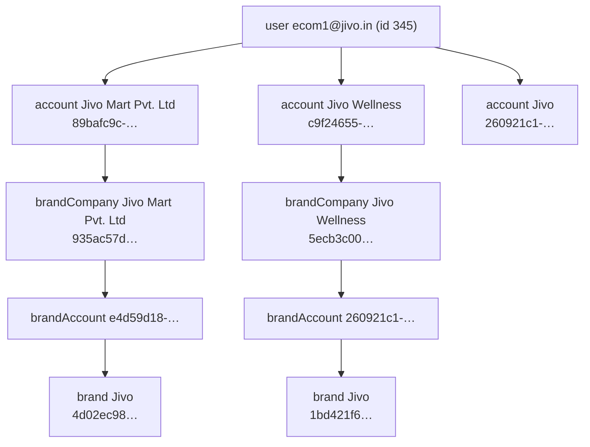
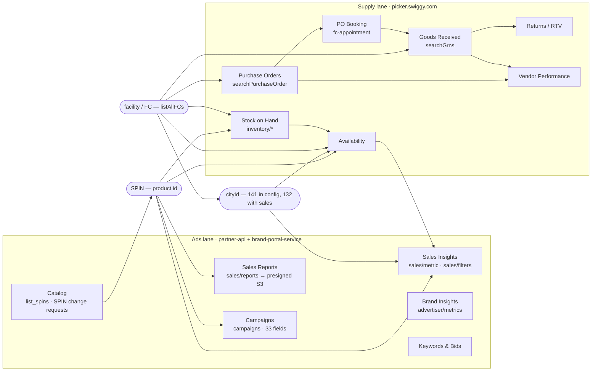
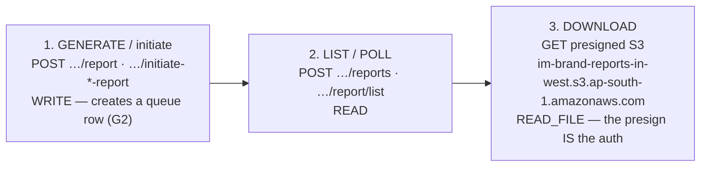

# Swiggy Instamart — how the sections join into one graph

This note is the join map: which identifier connects which surface to which. It is what turns 28
section notes into one queryable picture, and it is the thing you need before writing any analysis
that spans the ads lane and the supply lane.

## The five identifiers that matter

| Id | What it keys | Where it comes from | Appears in |
|---|---|---|---|
| **`SPIN`** (e.g. `L7P0RZ1JUI`) | a sellable product | catalog | sales insights, sales xlsx (`ITEM_CODE`), catalog, ads targeting, sampling |
| **`accountId`** (uuid) | an ads/brand account | `account/list` | every brand-portal call as `x-client-account-id`; campaigns; sales filters |
| **`brandCompanyId`** (sha1-like) | the legal company | `account/list` | supply lane (`supply_companies`), catalog |
| **`cityId`** (numeric, 1–10459) | a city | `configs.IM_ENABLED_CITIES` | sales metric rows, availability, PO facility city |
| **`facility` / `FC`** (e.g. `BLR IM3`, `CBE Ecom`) | a dark store / fulfilment centre | `listAllFCs` | POs, GRN, stock on hand, availability, appointments |

**The critical seam:** the ads lane keys on `SPIN` + `cityId`; the supply lane keys on
`facility` + `vendorCode`. They meet at the product (SPIN) and at the city — a facility belongs to
a city — but **not** at any single shared row. Joining "did we sell out because we were out of
stock?" therefore requires SPIN × city × date on the ads side against SPIN × facility × date on
the supply side, with facility→city resolved from `listAllFCs`.

## The entity hierarchy

Note that "Jivo" exists as **both** a selectable account (`260921c1`) and as the brand *inside*
Jivo Wellness — which is why account `260921c1` and account `c9f24655` return identical sales
filters but different campaign counts. Campaigns hang off the parent account; sales hang off the
brand.

## The two lanes and where they meet

## The PO lifecycle (supply lane)

`searchPurchaseOrder` → a PO with a facility, vendor, ordered qty and expiry
→ **PO Booking** turns it into an appointment (`fc-appointment/*`)
→ the facility receives it, producing a **GRN** (`searchGrns` / `grn/searchGrnLines`)
→ shortfalls and rejections flow into **Returns / RTV**
→ receipt performance is scored in **Vendor Performance**
→ what actually sits in the store is **Stock on Hand**, and whether it was buyable is
**Availability**.

Ordered qty (PO) minus received qty (GRN) is the fill-rate gap; GRN qty against Stock-on-Hand
movement is the sell-through. **Both halves are readable and JIVO reads neither.**

## The report model — identical on every surface

Every reporting surface on this portal follows one three-step shape:

Step 2 and step 3 are reads and are exposed. **Step 1 is a write and is not** — it creates a row
and consumes the account's report quota. `reportStatus` moves to `STATUS_COMPLETED` before
`downloadUrl` is populated. Report families found: sales (`sales/reports`), ads summary
(`advertiser/metrics/report/list`), BDPO/discount (`discount/reports`, `report/list-bdpo`) and the
vendor lane's own queue (`/im-vendor/downloads`).

## Metric vocabulary as a dimension cube

`sales/metric` and `advertiser/metrics` are the same shape: pick metrics, pick a dimension
grouping, pick filters.

- **47 metric types** — sales, units sold, orders, customers, GMV, market share, three
  share-of-voice variants, impressions, clicks, CTR, CVR, conversions, spend, budget burnt
  (incl. realtime), ROAS, ROI, CPO, eCPS, AOV, reach, sessions, new-user counts, product rating,
  and benchmark CTR/CVR/ROI.
- **17 dimension types** — day, week, month, date, city, product, brand, account, campaign name,
  campaign source, keyword, L-category.
- **25 filter types** — date/start/end, account, brand, brand company, campaign id/name/status/
  type, category, city, product, keyword (+ match type, + type), creative, placement, channel,
  ad candidate id/type, impressions, zero-values.

Every response row carries `currentValue`, `priorValue`, `delta` and `deltaUnit`, so
period-over-period comparison is built in and does not need computing locally.

## Connections

- [[00-Swiggy-Instamart-Atlas]] · [[Swiggy-Instamart-Endpoints]] ·
  [[Swiggy-Instamart-Data-Inventory]] · [[Auth-and-Access]] · [[Read-Only-Guardrails]]
- Product identity: [[Catalog-SPIN-Management]] · [[Products-And-SPINs]]
- City/geo: [[Config-And-Feature-Flags]] · [[Sales-Insights]] · [[Availability-and-Fill-Rate]]
- PO lifecycle: [[Purchase-Orders]] → [[PO-Booking-Appointments]] → [[Goods-Received-GRN]] →
  [[Returns-RTV-and-Purchase-Returns]] → [[Vendor-Performance-Scores]]
- Reporting: [[Sales-Reports]] · [[Vendor-Downloads]] · [[Discounts-BDPO]] ·
  [[Brand-Insights-Metrics]]
- Entities: [[Accounts-And-Entities]]
