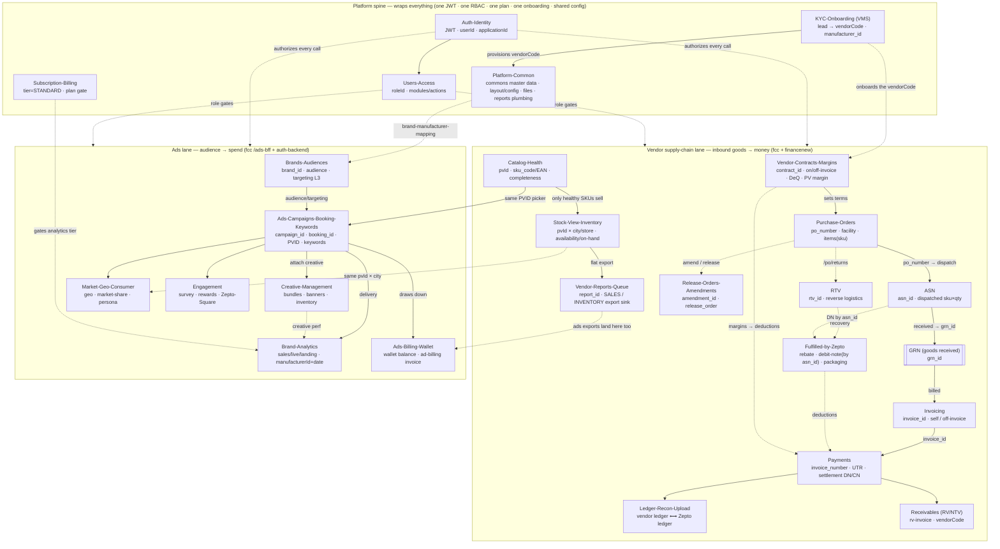

# Zepto Seller Portal — Data Model

How the **25 studied sections** of the Zepto seller portal wire together into one relational
graph for JIVO — Jivo Wellness Pvt. Ltd. (Manufacturer, STANDARD tier, `manufacturer_id
946950b7-1ce2-4bdf-a7c4-37499e3f5f34`, ads brand *Jivo* `brand_id
b3550d5d-fc71-47b0-af4f-f221f909b936`, login `ecom1@jivo.in`, role "External Super Ads Admin",
`userId 5116e7a0-cc01-4b7d-b098-810cb32dee02`). Every section is a **view over the same small set
of business keys** — manufacturer, vendor code, brand, PVID/SKU, PO/ASN/GRN, invoice, contract,
campaign — so the whole portal reads as one graph, not 25 unrelated grids. This note maps that
graph. It is grounded entirely in the on-disk JS corpus (`captures/js/sections.json` +
`captures/js/endpoints-raw.json`, 741 endpoints) and the 25 section notes; **no live write was ever
fired** (every probe this study made returned 401/404/429 on the expired token — see each section
note). Read-only law applies: writes/exports are documented out-of-scope only.

There are **three lanes** stitched by a shared **platform** spine:

1. **Vendor supply-chain lane (inbound goods → money).**
   [[Purchase-Orders]] → [[ASN]] → **GRN** → [[Invoicing]] → [[Payments]] / [[Ledger-Recon-Upload]] /
   [[Receivables]], with [[Release-Orders-Amendment-Requests]] and [[RTV]] as PO offshoots,
   [[Fulfilled-by-Zepto]] as the rebate/debit-note/packaging recovery arm, the assortment triangle
   [[Catalog-Health]] → [[Stock-View-Inventory]] → [[Vendor-Reports-Queue]], and
   [[Vendor-Contracts-Margins]] setting the commercial terms the whole lane settles on.
2. **Ads lane (audience → spend).**
   [[Brands-Audiences]] → [[Ads-Campaigns-Booking-Keywords]] → [[Creative-Management]] →
   [[Brand-Analytics]] / [[Market-Geo-Consumer-Insights]] / [[Engagement]] → [[Ads-Billing-Wallet]].
3. **Platform spine (wraps both lanes).**
   [[Auth-Identity]] / [[Users-Access]] / [[Subscription-Billing]] / [[KYC-Onboarding]] /
   [[Platform-Common]] — one JWT, one RBAC, one plan gate, one onboarding pipeline, one config/
   master-data/file plumbing that every lane above draws on.

## Backends (which host each key lives on)

One JWT (header `authorization: <jwt>`, **no** `Bearer`) authenticates all of them; WAF not enforced.

| Host | Serves |
|---|---|
| **`fcc.zepto.co.in`** | vendor reports (`api/v1/reports*`), PO/GRN/ASN/RTV, `api/v1/payment/*`, `vendor/api/v1/ledger-*`, `contractservice/*`, catalog-health, `brand-analytics-web/-mobile/*` (stock-view, sales/live/landing, geo/market/persona, recon), `vms/*` (KYC/onboarding), `ads-bff/*` (whole ads lane), `survey/`+`gamification-service/`, `layout/config/*`, `crm-ticketing/*` |
| **`auth-backend.zepto.co.in`** | identity (`api/v1/auth/*`), RBAC (`api/v1/access-management/*`), commons master data (`api/v1/commons/*`), `api/v1/zepto-square/*`, chat token |
| **`financenew.zepto.co.in`** | FBZ rebate + `vendor-debit-note/*` (the `n.sx` base) |
| **`scpfin.zepto.co.in`** | supply-chain finance (`n.Qw` base; FBZ margin/DN sibling) |
| **`events.zepto.co.in`** | analytics event sink (`api/v2/publish-events`) — write-only, out of scope |

## The join keys

The whole model reduces to a dozen keys. Every arrow in the graph below is one of these.

| Key | Column names / bindings seen across sections | Joins |
|---|---|---|
| **manufacturer_id** `946950b7-…` | `manufacturerId` (analytics query param), `vms/api/v2/vendor/manufacturer-ids`, `contractservice/…/common/get-brands-of-manufacturer`, `commons/brand-manufacturer-mapping` | the root entity — every lane is scoped to JIVO by this |
| **brand_id** `b3550d5d-…` | `brand_id` query across `ads-bff/*` (creative `metadata?brand_id=`, `banners`, campaigns, `audience-reach`, smart-nudges, rewards `brand/{id}`, zepto-square) | the **ads-lane** entity key; tied to manufacturer via `brand-manufacturer-mapping` |
| **vendor_id / vendorCode** | `user/vendor-list` filters (PO/GRN/ASN/RTV), FBZ rebate `{vendorCode}`, `vms/…/receivable-vendor`, `contractservice/…/common/vendor-details` (by code), `commons/search-vendors` | stitches PO·ASN·GRN·RTV·[[Fulfilled-by-Zepto]]·[[Receivables]]·[[Vendor-Contracts-Margins]]·[[Payments]] |
| **po_number** (PO id) | `api/v1/po/{id}`, `getAsnByPoId` (`/po/{id}/asn`), `getGrnByPoId` (`/po/{id}/grn`), `/po/returns/:rtvId` | [[Purchase-Orders]] ↔ [[ASN]] ↔ GRN ↔ [[RTV]] ↔ [[Release-Orders-Amendment-Requests]] |
| **asn_id** | `api/v1/asn/{id}`, `getGrnByAsnId` (`/asn/{id}/grn-info`), `getDnCnDetails` (`/asn/{id}/settlement-info`), FBZ `vendor-debit-note/asn/{id}` | [[ASN]] ↔ GRN ↔ [[Fulfilled-by-Zepto]] DN ↔ [[Payments]] settlement |
| **grn_id** | `api/v1/grn/{id}`, `/grn/{id}/items`, `getAsnByGrnId` (`/grn/{id}/asn-info`) | the receipt hinge — [[Purchase-Orders]]/[[ASN]] → [[Invoicing]] |
| **invoice_id** | `vendorInvoiceId`/`orderNumber` (self-invoice `{id}/details`), `invoice_number` + `order_number` (`payment/invoice/filter`), `ntv-invoice`, `rv-invoice`, `getPaymentDocById` | [[Invoicing]] ↔ [[Payments]] ↔ [[Receivables]] ↔ [[Ledger-Recon-Upload]] |
| **contract_id / mi_id** | `contractservice/…/vendor-contract/{id}`, `margin-incentive/{id}/list-item-margin-details`, `off-invoice/contracts/{id}`, `amendment-requests` `vendor-contract/{id}`, `common/fbz-margins` | [[Vendor-Contracts-Margins]] ↔ [[Invoicing]] (off-invoice) ↔ [[Release-Orders-Amendment-Requests]] ↔ [[Fulfilled-by-Zepto]] ↔ [[Payments]] (deductions) |
| **pvId / PVID + sku_code / EAN** | `catalog-health-dashboard/get-l4-values/{pvId}`, `ads-bff/…/validate_pvids`, `sku-stock-view` ("SKU Codes"), PO/ASN/GRN/RTV `…/items`, `*/product-level-performance` | [[Catalog-Health]] ↔ [[Stock-View-Inventory]] ↔ [[Brand-Analytics]]/[[Market-Geo-Consumer-Insights]] ↔ [[Ads-Campaigns-Booking-Keywords]] (PVID attach) ↔ PO/ASN items |
| **campaign_id / booking_id** | `ads-bff/api/v1/campaigns/{id}`, `booking/{id}`, `brands/campaigns/analytics/*`, billing per `roId` | [[Ads-Campaigns-Booking-Keywords]] ↔ [[Creative-Management]] (bundles) ↔ [[Brand-Analytics]] ↔ [[Ads-Billing-Wallet]] |
| **report_id** (UUID) | `api/v1/reports?offset=&limit=`, `api/v1/reports/{id}/download` (e.g. `a936dc69-679f-4e8a-95f1-3ca802b01246`) | the async **export sink** — every SALES/INVENTORY/ads export lands in [[Vendor-Reports-Queue]] |
| **userId / roleId / applicationId** | JWT `sub 5116e7a0-…`, `roleId fb6306b3-…`, `applicationId d0cd4873-…`; `access-management/{users,roles}`, `authorize/fetch-all-modules-*` | [[Auth-Identity]] ↔ [[Users-Access]] — the RBAC that gates every section |

Two cross-cutting overlays ride on top: **date window** (`startDate`/`endDate`, ISO-8601 UTC —
time-aligns every analytics read) and **subscription tier** (`STANDARD`; module id `STOCK_VIEW =
4f58dea3-e8ea-451c-8b50-509dd6f700cf` gated by [[Subscription-Billing]]).

## Graph

## Vendor lane — join key: vendor_id → po_number → grn_id → invoice_id

A single purchase order threads the goods-and-money spine, joined on **po_number**, then
**grn_id**, then **invoice_id**:

1. **[[Vendor-Contracts-Margins]]** (upstream terms). The contract (`contract_id`) fixes what
   Zepto pays JIVO and deducts — on-invoice / off-invoice margins, DeQ, stock-correction, and the
   FBZ **PV (price-variance) base margin**. These margins are what later surface as **deductions**
   in [[Payments]] and rebates/DNs in [[Fulfilled-by-Zepto]]. [[Release-Orders-Amendment-Requests]]
   raises `amendment_id`s against this same `contract_id`.
2. **[[Purchase-Orders]]** — Zepto raises a PO (`po_number`) to JIVO for a delivery facility (mother-hub),
   carrying line items (`sku_code`×qty) and a lifecycle (Created → Scheduled → Delivered/GRN'd). The PO
   detail exposes `getAsnByPoId` and `getGrnByPoId`, so the join to the next two hops is literally the
   same `po_number`.
3. **[[ASN]]** — JIVO files the advance shipping notice (`asn_id`) *against* that PO — dispatched
   `sku`×qty, source/destination facility, uploaded invoice. `getGrnByAsnId` links it forward to the
   receipt; `getDnCnDetails` and `vendor-debit-note/asn/{id}` link its settlement into [[Fulfilled-by-Zepto]].
4. **GRN** (`grn_id`) — what the hub actually received against the ASN; the ordered-vs-received delta.
   This is the hinge where goods become billable.
5. **[[Invoicing]]** — the vendor invoice (`invoice_id`) is raised/booked (self-invoice/NTV) and
   **off-invoice rules** (discounts applied off the trade invoice) hang off the `contract_id`.
6. **[[Payments]]** — the settlement face of those invoices (`invoice_number`/`order_number`): the money
   ladder Invoice → GRN → Discrepancy → Approved → **Deductions** {rebate, PV, off-invoice margin} →
   **Net Payable**, a `payment_state`, and a **UTR**. It also carries the RV/NTV receivable side
   (`rv-invoice`, `ntv-invoice`).
7. **[[Ledger-Recon-Upload]]** + **[[Receivables]]** — the recon of vendor books vs Zepto's ledger
   (`ledger-upload/vendor` vs `payment/ledger/zepto`), closing balances and the signed-off statement;
   and the AR / non-trade-vendor side (`receivable-vendor/filter` by `vendorCode`) where Zepto's DN/CN
   against JIVO settle.

**Offshoots.** [[RTV]] is the reverse of the inbound flow (goods sent *back* to JIVO, reached via
`/po/returns`), whose recoveries post as debit notes in [[Fulfilled-by-Zepto]] and settle in
[[Payments]]. [[Fulfilled-by-Zepto]] itself is the recovery arm — per-vendor **rebate** margins
(`fbz/rebate/{vendorCode}`), **vendor debit/credit notes** (raised against an `asn_id`), and
**packaging** bag-barcodes — living on `financenew.zepto.co.in`, not fcc.

## Vendor lane — the assortment triangle (join key: pvId / sku_code)

Three SKU-level surfaces share **pvId / sku_code** and gate what the money lane can even move:

- **[[Catalog-Health]]** — is my SKU complete/correct? Per-`pvId` attribute-completeness + data-quality
  ruleset scores, and SKU-onboarding. It is the SKU *universe* — only onboarded/healthy SKUs get POs
  and can hold stock. Its `ads-bff/api/v1/catalog` PVID picker is **the same picker the ads lane reuses**.
- **[[Stock-View-Inventory]]** — is my SKU available / how much sits in Zepto? `pvId × city/store`
  availability + on-hand, served by `brand-analytics-web`. Low stock at a facility is what a
  replenishment [[Purchase-Orders]] refills.
- **[[Vendor-Reports-Queue]]** — the async **export sink** (`report_id`). The flat **SALES** and
  **INVENTORY** exports of the two surfaces above (already pulled by the existing `zepto-cli`) land here
  via `POST /api/v1/reports/request` → poll `/api/v1/reports` → `GET /api/v1/reports/{id}/download`.
  Every lane's bulk export funnels into this one queue.

## Ads lane — join key: brand_id → campaign_id → booking_id

The ads lane is scoped by **brand_id** (`b3550d5d-…`, tied to `manufacturer_id` via
`brand-manufacturer-mapping`), then threads **campaign_id** / **booking_id**:

1. **[[Brands-Audiences]]** — the brand roster + audience builder: parent-brands, L3 targeting
   categories, per-brand audience attributes and reach estimates, saved audiences. Feeds the brand
   header the analytics dashboards sit under.
2. **[[Ads-Campaigns-Booking-Keywords]]** — the campaign engine: PLA/display campaigns
   (`campaign_id`) rolling up into media-plan **bookings** (`booking_id`), keyword/bid tooling, and the
   Jarvis/KAM AI copilots. Campaigns attach **PVIDs** from the same catalog picker as [[Catalog-Health]].
3. **[[Creative-Management]]** — the assets a booking attaches: ad-unit inventory, banners, and saved
   **bundles** (v1/v2) keyed by `brand_id` + `ad_format_id`.
4. **[[Brand-Analytics]]** / **[[Market-Geo-Consumer-Insights]]** / **[[Engagement]]** — the
   performance read-back. All three key on `manufacturerId` + date window and slice by `pvId` / city /
   store, sharing the `brand-analytics-web` backend with [[Stock-View-Inventory]]. Engagement adds
   surveys, gamification rewards, and Zepto-Square stats (the latter on `auth-backend`, needing an
   `x-client-id`).
5. **[[Ads-Billing-Wallet]]** — the money side: the ad **wallet** campaigns draw down and the
   **billing** invoices Zepto raises against ad spend (per `roId`). It is the ads-lane counterpart of
   the vendor-lane [[Payments]].

## Platform spine — wraps both lanes (join key: userId / roleId / manufacturer_id)

- **[[Auth-Identity]]** mints the single JWT (`api/v1/auth/*` on auth-backend; `get-user-by-token` on
  fcc) that authorizes **every** call in both lanes. `whoami` is the natural stack-wide doctor check.
- **[[Users-Access]]** is the RBAC (`access-management/*` + `authorize/fetch-all-modules-*`): a
  `roleId` decides whether a user can see [[Payments]], run [[Vendor-Reports-Queue]], or manage
  [[Ads-Campaigns-Booking-Keywords]].
- **[[KYC-Onboarding]]** (VMS) is the lead → vendor pipeline that **provisions the `vendorCode`** the
  whole vendor lane then operates on, and links it to `manufacturer_id`.
- **[[Subscription-Billing]]** is the plan gate deciding which [[Brand-Analytics]] tiers a STANDARD-tier
  brand unlocks.
- **[[Platform-Common]]** is the shared plumbing every lane leans on: `commons/*` master data
  (vendor/manufacturer/brand/category/city lookups + `brand-manufacturer-mapping`), `layout/config/*`
  UI metadata, the file/attachment/pre-signed-download layer, and the download side of the
  [[Vendor-Reports-Queue]] / [[Ledger-Recon-Upload]] exports.

## Grain summary (one row means…)

| Section | One row = | Primary key(s) | Time key |
|---|---|---|---|
| [[Purchase-Orders]] | one purchase order (header) | `po_number` | issue / expiry date |
| [[Purchase-Orders]] items · GRN | one SKU on a PO / one received line | `po_number`×`sku`, `grn_id`×`sku` | — |
| [[ASN]] | one advance shipping notice | `asn_id` (→ `po_number`) | dispatch / status dates |
| [[Release-Orders-Amendment-Requests]] | one amendment / release order | `amendment_id` (× `contract_id`) | state-timeline |
| [[RTV]] | one return-to-vendor | `rtv_id` | RTV dates |
| [[Invoicing]] | one invoice / off-invoice rule set | `invoice_id` · `contract_id` | GRN / invoice date |
| [[Payments]] | one invoice's payout | `invoice_number` (× `order_number`) → **UTR** | invoice / due / payment date |
| [[Ledger-Recon-Upload]] | one recon working / ledger line | `vendorCode` × cycle | recon cycle |
| [[Receivables]] | one receivable/non-trade vendor | `vendorCode` | — |
| [[Fulfilled-by-Zepto]] | one rebate row / debit note / bag-barcode | `vendorCode` / DN id / `asn_id` | — |
| [[Vendor-Contracts-Margins]] | one contract / margin schedule | `contract_id` / `mi_id` | state-timeline |
| [[Catalog-Health]] | a SKU's completeness/quality score | `pvId` / `sku_code` | — (state) |
| [[Stock-View-Inventory]] | a SKU's stock/availability at a place | `pvId` × city/store | `startDate..endDate` |
| [[Vendor-Reports-Queue]] | one requested export | `report_id` (UUID) | `reportPayload.{startDate,endDate}` |
| [[Brands-Audiences]] | a brand / audience definition | `brand_id` | — |
| [[Ads-Campaigns-Booking-Keywords]] | one campaign / booking | `campaign_id` / `booking_id` | flight dates |
| [[Creative-Management]] | one creative bundle / banner | bundle id × `brand_id` | — |
| [[Brand-Analytics]] / [[Market-Geo-Consumer-Insights]] | one metric over an entity | `manufacturerId` × `pvId`/city | `startDate..endDate` |
| [[Engagement]] | one survey / reward / square stat | survey_id / reward_id / `brand_id` | — |
| [[Ads-Billing-Wallet]] | one wallet txn / ad-billing run | wallet txn id / billing id (`roId`) | billing period |
| [[Auth-Identity]] / [[Users-Access]] | one user / role | `userId` / `roleId` | — |
| [[KYC-Onboarding]] | one lead / onboarding record | lead `userId` / `vendorCode` | onboarding status |
| [[Subscription-Billing]] | the account's plan state | `manufacturer_id` × tier | plan period |
| [[Platform-Common]] | one config / master-data / file row | key / id | — |

## Connections

- Portal shell & index: [[00-Zepto-Atlas]] · [[00-Zepto-Atlas]] · master endpoint index [[Zepto-Endpoints]]
- Auth model & scope: [[Auth-and-Access]] · [[Read-Only-Guardrails]]
- Vendor supply chain: [[Purchase-Orders]] → [[ASN]] → [[Invoicing]] → [[Payments]] / [[Ledger-Recon-Upload]] / [[Receivables]] ; offshoots [[Release-Orders-Amendment-Requests]] · [[RTV]] · [[Fulfilled-by-Zepto]] ; assortment [[Catalog-Health]] → [[Stock-View-Inventory]] → [[Vendor-Reports-Queue]] ; terms [[Vendor-Contracts-Margins]]
- Ads: [[Brands-Audiences]] → [[Ads-Campaigns-Booking-Keywords]] → [[Creative-Management]] → [[Brand-Analytics]] / [[Market-Geo-Consumer-Insights]] / [[Engagement]] → [[Ads-Billing-Wallet]]
- Platform spine: [[Auth-Identity]] · [[Users-Access]] · [[Subscription-Billing]] · [[KYC-Onboarding]] · [[Platform-Common]]
