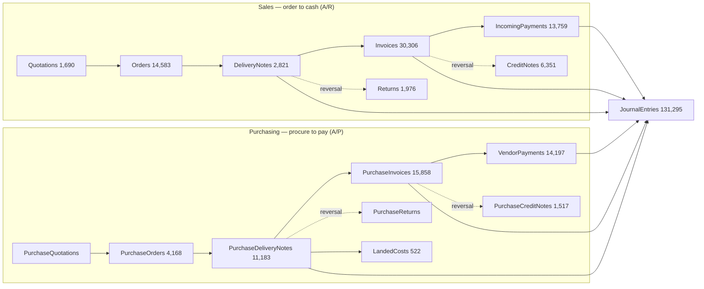

# SAP B1 Data Model

How the 498 services in this vault hang together. SAP Business One is a document-chain ERP: a handful of **master data** tables anchor everything, **marketing documents** copy into each other along base/target chains, and every posting lands in the **G/L journal**. Numbers in brackets are live row counts in `JIVO_OIL_HANADB` (see [[03-Live-Data-Census]]).

## Master data — the anchors

| Entity | Key | Role |
|---|---|---|
| [[BusinessPartners]] (3,384) | `CardCode` | Customers, vendors and leads in ONE table (`CardType` = cCustomer/cSupplier/cLid). Referenced by 49 service notes in this vault — the most-joined key in the schema. |
| [[Items]] (2,264) | `ItemCode` | The SKU master — oils, raw materials, packaging. Joined from 27 notes; carries UoM, tax, batch/serial flags, per-warehouse stock. |
| [[Warehouses]] (58) | `WarehouseCode` (a.k.a. `WhsCode`) | 58 depots/plants; 35 notes join a warehouse code, usually per document line. |
| [[ChartOfAccounts]] (1,423) | `AcctCode` / `AccountCode` | G/L account master; ~29 notes reference an account code for posting determination. |
| [[SalesPersons]] (155) | `SalesPersonCode` | Sales reps — stamped on 21 document types. |
| [[EmployeesInfo]] (17) | `EmployeeID` | HR master; links to [[SalesPersons]], [[Departments]], [[Branches]], [[Users]]. |
| [[Projects]] | `ProjectCode` | Financial project dimension on lines and journals (13 notes join it). |
| [[Currencies]] (6) | `Currency` | Document and row currency on every priced document. |
| [[PriceLists]] (10) + [[SpecialPrices]] (22) | `PriceList` | Item pricing; BP master points at its default price list. |
| [[BatchNumberDetails]] (17,257) | `Batch` + `ItemCode` | Batch traceability for oil lots; feeds batch allocations on stock documents. |
| [[ProductTrees]] (620) | `TreeCode` = `ItemCode` | Bills of material consumed by [[ProductionOrders]]. |

Classification satellites: [[ItemGroups]], [[ItemProperties]], [[BusinessPartnerGroups]], [[BusinessPartnerProperties]], [[Territories]], [[Industries]], [[Manufacturers]], [[UnitOfMeasurements]], [[UnitOfMeasurementGroups]], [[BinLocations]], [[States]], [[Countries]].

## Document flow — base → target chains

Marketing documents copy into each other. Each line of a target document carries `BaseEntry` (source `DocEntry`), `BaseLine` and `BaseType` — 20 service notes in this vault document these chains (grep `BaseEntry` in `services/`).

### Sales flow (A/R) — domain [[sales-ar]]
[[Quotations]] → [[Orders]] → [[DeliveryNotes]] → [[Invoices]] → [[IncomingPayments]] (in [[banking-payments]]). Reversals: [[ReturnRequest]] / [[Returns]] against deliveries, [[CreditNotes]] against invoices. [[Drafts]] (47k) holds any A/R document pre-posting; [[DownPayments]] handles advances. Delivery and invoice notes confirm the chain: their lines' `BaseEntry` points back at the order ("[[DeliveryNotes]] via their DocumentLines.BaseEntry pointing back at the order" — from the [[Orders]] note).

### Purchase flow (A/P) — domain [[purchasing]]
[[PurchaseRequests]] → [[PurchaseQuotations]] → [[PurchaseOrders]] → [[PurchaseDeliveryNotes]] (Goods Receipt PO) → [[PurchaseInvoices]] → [[VendorPayments]] (in [[banking-payments]]). Reversals: [[GoodsReturnRequest]] / [[PurchaseReturns]] and [[PurchaseCreditNotes]]. [[LandedCosts]] allocates freight/customs onto GRPO lines — key for JIVO's imported oil. [[PurchaseDownPayments]] handles advances to vendors.

### Inventory flow — domains [[inventory-warehouse-1]] / [[inventory-warehouse-2]]
Non-sales stock movements: [[InventoryGenEntries]] (7,892 goods receipts) and [[InventoryGenExits]] (7,765 goods issues); [[InventoryTransferRequests]] (1,282) → [[StockTransfers]] (11,668) between the 58 [[Warehouses]] (staged in [[StockTransferDrafts]], 47k); [[PickLists]] (3,598) stage warehouse picking for deliveries; [[InventoryCountings]] / [[StockTakings]] (126k) reconcile physical counts; [[InventoryOpeningBalances]] seed stock. Manufacturing consumes and produces stock via [[ProductionOrders]] (7,683) exploding [[ProductTrees]] BOMs. Every movement line carries `ItemCode` + `WarehouseCode`, and batch-managed items drag [[BatchNumberDetails]] allocations along.

### Finance core — domains [[financials-accounting-1]] / [[financials-accounting-2]]
Every posting document above generates a journal entry: [[JournalEntries]] (131k) is the single G/L transaction table, with `TransactionCode`/`Reference` linking back to origin documents and lines hitting [[ChartOfAccounts]]. Around it: [[VatGroups]] + [[TaxCodeDeterminations]] + [[IndiaHsn]] (GST), [[WithholdingTaxCodes]] (TDS), [[GLAccountAdvancedRules]] + [[FAAccountDeterminations]] (account determination), [[Budgets]]/[[BudgetScenarios]], cost dimensions ([[Dimensions]], [[ProfitCenters]], [[DistributionRules]]), [[FinancialYears]], [[InternalReconciliations]] matching open items, and payment clearing from [[IncomingPayments]]/[[VendorPayments]].

## Universal join keys

Grepped from the actual `## Connections` sections of the service notes (`grep -l "via CardCode" services/*.md` → 49 files, etc.):

| Key | Found in | Joins |
|---|---:|---|
| `CardCode` | 49 notes | Any document/payment/activity → [[BusinessPartners]] |
| `ItemCode` (often `DocumentLines.ItemCode`) | 27 notes | Document lines → [[Items]] |
| `WarehouseCode` / `WhsCode` | 35 notes | Lines/stock rows → [[Warehouses]] |
| `DocEntry` | every document | Internal primary key of a document; what `BaseEntry` points at |
| `BaseEntry` + `BaseType` + `BaseLine` | 20 notes | Target document line → its base document (the flow arrows above) |
| `SalesPersonCode` | 21 notes | Documents → [[SalesPersons]] |
| `AcctCode` / account fields | 29 notes | Postings → [[ChartOfAccounts]] |
| `ProjectCode` | 13 notes | Lines/journals → [[Projects]] |
| `PriceList` | 9 notes | BP/items → [[PriceLists]] |
| `DocNum` vs `DocEntry` | — | `DocNum` is the human-visible number (per [[SeriesService]] numbering); **always join on `DocEntry`**, filter/display with `DocNum` |

## Reading tips

- `./sapb1 fields <Entity>` shows real field names (live `$top=1` probe with offline catalog fallback).
- Line items live in the `DocumentLines` collection inside each document — `--select` top-level fields for speed, `--json` to see lines.
- `DocumentStatus eq 'bost_Open'` + `Cancelled eq 'tNO'` = the live open book on any marketing document.
- All of the above is read via [[00-SAP-B1-Atlas]] rules: GET only, never write.
